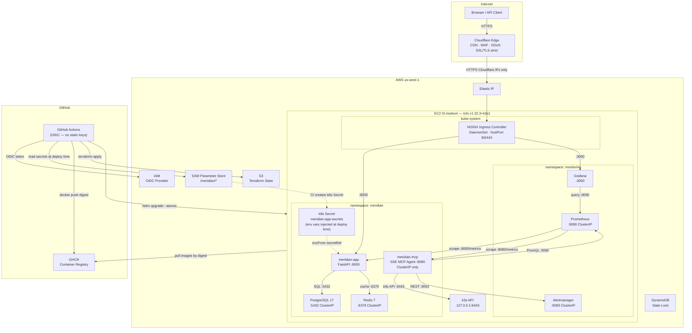
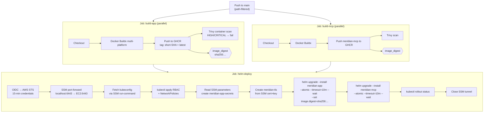

# Meridian Platform

> A cost-optimised, production-grade DevOps platform on AWS — FastAPI URL shortener,
> full observability stack, GitOps CI/CD, and an AI-powered MCP diagnostic agent.
> Zero static credentials. Zero open SSH ports. Everything in SSM.

[](https://github.com/TsembA/Meridian/actions/workflows/deploy.yml)
[](https://github.com/TsembA/Meridian/actions/workflows/security.yml)
[](LICENSE)

---

## Table of Contents

1. [What is Meridian](#what-is-meridian)
2. [Architecture](#architecture)
3. [Repository Structure](#repository-structure)
4. [Prerequisites](#prerequisites)
5. [First-Time Deployment](#first-time-deployment)
6. [CI/CD Pipeline](#cicd-pipeline)
7. [API Reference](#api-reference)
8. [MCP Diagnostic Agent](#mcp-diagnostic-agent)
9. [Observability](#observability)
10. [Security Architecture](#security-architecture)
11. [Day-to-Day Operations](#day-to-day-operations)
12. [Troubleshooting](#troubleshooting)
13. [Disaster Recovery](#disaster-recovery)
14. [Cost Breakdown](#cost-breakdown)
15. [Scalability](#scalability)
16. [Known Limitations and Roadmap](#known-limitations-and-roadmap)
17. [Development](#development)
18. [License](#license)

---

## What is Meridian

Meridian is a URL shortening service: it accepts a long URL, returns a 7-character cryptographically random short code, and performs fast 302 redirects using a Redis-first caching strategy backed by PostgreSQL.

The primary purpose of the platform is as an **infrastructure and architecture demonstration**. The application itself is simple; the surrounding system is not.

| Concern | Decision | Alternative rejected | Why |
|---------|----------|---------------------|-----|
| Compute | EC2 t3.medium + k3s v1.32 | EKS | EKS control plane costs $72/month; k3s gives identical Kubernetes semantics at zero control-plane cost |
| CDN / WAF | Cloudflare (free tier) | AWS ALB + WAF | ALB adds ~$18/month and CloudFront ~$5/month; Cloudflare provides DDoS, WAF, and SSL at $0 |
| Secrets | SSM Parameter Store → k8s Secret | Secrets Manager | SSM Standard tier is free; Secrets Manager charges $0.40/secret/month. Runtime app reads from env vars — no AWS API calls at runtime |
| Auth (CI) | GitHub OIDC → IAM role | IAM access keys | OIDC tokens are short-lived (15 min); no static credentials exist anywhere in the system |
| Shell access | SSM Session Manager | SSH | SSH requires an open port 22; SSM requires zero open inbound ports and provides CloudTrail audit logs |
| IaC | Terraform | CDK / Pulumi | Terraform is the industry-standard declarative tool; remote state with DynamoDB locking |
| Container base | distroless nonroot (UID 65532) | Alpine | Distroless has no shell and no package manager — post-exploitation surface is minimal |
| Ingress | NGINX hostPort 80/443 | NodePort | Cloudflare connects on standard ports 80/443; NodePort would require non-standard ports |

---

## Architecture



**Key architectural notes:**

- The security group allows inbound traffic **only from Cloudflare IP ranges** (maintained via Terraform), not from `0.0.0.0/0`.
- The FastAPI app reads secrets from **environment variables** injected from the `meridian-app-secrets` k8s Secret. It does not call AWS APIs or boto3 at runtime. The k8s Secret is created by GitHub Actions at deploy time by fetching SSM parameters with temporary OIDC credentials.
- The IMDS hop limit is set to 1. Containers on the node **cannot reach the EC2 instance metadata service** — stolen container credentials cannot escalate to the instance IAM role.
- The k3s API server is bound to `127.0.0.1:6443` only. CI access is via SSM `AWS-StartPortForwardingSession` tunnel — no public API endpoint.
- The MCP agent uses **SSE (Server-Sent Events)** transport over HTTP on port 8080. It is a ClusterIP service, reachable via SSM port-forward.
- Cloudflare SSL mode is **strict**: Cloudflare presents a publicly-trusted certificate to browsers and verifies the Cloudflare Origin CA certificate on the connection to the origin EC2.

---

## Repository Structure

```
Meridian/
├── .github/
│   └── workflows/
│       ├── deploy.yml          # Build Docker images + Helm deploy to k3s
│       ├── security.yml        # Trivy (fs/IaC/container) + Bandit SAST + pytest
│       └── terraform.yml       # terraform fmt/validate/plan/apply
│
├── app/
│   ├── Dockerfile              # Multi-stage: python:3.12-slim-bookworm → distroless nonroot
│   ├── requirements.txt        # Pinned production dependencies
│   └── src/
│       ├── main.py             # FastAPI app, route handlers, lifespan context manager
│       ├── models.py           # Pydantic v2 request/response models and input validation
│       ├── database.py         # SQLAlchemy 2.0 async engine, ORM model, session factory
│       ├── cache.py            # Redis async client with graceful degradation on failure
│       ├── config.py           # Pydantic Settings — reads from environment variables
│       ├── logger.py           # Structured JSON log formatter, configures root logger
│       └── templates/
│           └── index.html      # Web UI served at GET /
│
├── mcp-agent/
│   ├── Dockerfile              # Multi-stage: python:3.12-slim-bookworm → distroless nonroot
│   ├── requirements.txt
│   └── src/
│       ├── server.py           # FastMCP SSE server entry point, uvicorn runner
│       ├── tools.py            # 6 read-only diagnostic tools (k8s, Prometheus, Alertmanager)
│       ├── audit.py            # JSONL audit log — every tool call recorded before/after exec
│       ├── config.py           # MCP agent settings from environment variables
│       └── logger.py           # Structured JSON logging
│
├── k8s/
│   ├── charts/
│   │   ├── meridian-app/       # Helm chart: FastAPI app + postgresql + redis subcharts
│   │   │   └── Chart.yaml      # Chart metadata; postgresql and redis as dependencies
│   │   └── meridian-mcp/       # Helm chart: MCP agent Deployment + Service
│   │       └── templates/
│   │           └── deployment.yaml
│   ├── manifests/
│   │   ├── rbac/               # ServiceAccount, ClusterRole, ClusterRoleBinding per workload
│   │   ├── network-policies/   # Default-deny + explicit allow NetworkPolicies
│   │   └── monitoring/         # Grafana dashboard ConfigMap
│   └── monitoring/
│       └── alerts/             # PrometheusRule CRDs for all alert definitions
│
├── infra/
│   ├── terraform/
│   │   ├── main.tf             # Provider config, S3 state bucket, DynamoDB lock table
│   │   ├── backend.tf          # Remote state backend (S3 + DynamoDB)
│   │   ├── variables.tf        # All input variables — no sensitive defaults
│   │   ├── ec2.tf              # EC2 instance, security group (CF IPs only), EIP, IAM
│   │   ├── cloudflare.tf       # DNS records, zone settings, Origin CA certificate
│   │   └── ssm.tf              # SSM parameter definitions (TLS cert/key written by Terraform)
│   └── scripts/
│       ├── bootstrap.sh        # One-time: create S3 bucket + DynamoDB table before terraform init
│       └── cloud-init.yaml     # EC2 first-boot: k3s, Helm, monitoring stack installation
│
└── docs/
    └── RUNBOOK.md              # Deep-dive operations and architecture runbook
```

---

## Prerequisites

### Required Tools

| Tool | Minimum Version | Purpose |
|------|----------------|---------|
| Terraform | 1.9.x | Infrastructure provisioning |
| AWS CLI | v2 | SSM sessions, parameter management |
| AWS Session Manager Plugin | latest | SSM port-forwarding (required for SSM tunnels) |
| kubectl | 1.32.x | Cluster management (optional — CI handles deploys) |
| Helm | 3.16.x | Chart management (optional — CI handles deploys) |
| Docker | 24+ | Building images locally |
| Python | 3.12 | Running tests locally |
| git | any | Version control |

### Required Accounts

- **AWS Account** with administrator access for the initial setup. CI/CD subsequently uses a scoped OIDC role.
- **Cloudflare Account** with your domain configured as a Cloudflare zone (DNS managed by Cloudflare, Cloudflare proxy enabled).
- **GitHub Account** with a repository. GitHub Packages (GHCR) must be accessible from the repository.

### Terraform Provider Versions

```hcl
cloudflare = "~> 4.45"   # v5 has breaking schema changes (value → content in DNS records)
aws        = "~> 5.50"
tls        = "~> 4.0"
```

---

## First-Time Deployment

### Phase 1: Bootstrap Terraform State Backend

The S3 bucket and DynamoDB table that Terraform uses as its remote state backend must exist before `terraform init` can configure the backend. This circular dependency is broken by a one-time bootstrap script:

```bash
chmod +x infra/scripts/bootstrap.sh
AWS_REGION=us-west-1 bash infra/scripts/bootstrap.sh
```

The script creates the `meridian-platform-tfstate` S3 bucket (versioned, AES-256 encrypted) and `meridian-platform-tflock` DynamoDB table using the AWS CLI directly — not Terraform.

### Phase 2: Create SSM Parameters

All secrets are stored in SSM Parameter Store before Terraform or Helm run. SecureString parameters are KMS-encrypted at rest.

```bash
REGION=us-west-1

# Database
aws ssm put-parameter --name /meridian/db/host --type String \
  --value "meridian-app-postgresql.meridian.svc.cluster.local" --region $REGION
aws ssm put-parameter --name /meridian/db/port --type String \
  --value "5432" --region $REGION
aws ssm put-parameter --name /meridian/db/name --type String \
  --value "meridian" --region $REGION
aws ssm put-parameter --name /meridian/db/user --type String \
  --value "meridian_app" --region $REGION
aws ssm put-parameter --name /meridian/db/password --type SecureString \
  --value "$(openssl rand -base64 32)" --region $REGION

# Redis
aws ssm put-parameter --name /meridian/redis/host --type String \
  --value "meridian-app-redis-master.meridian.svc.cluster.local" --region $REGION
aws ssm put-parameter --name /meridian/redis/port --type String \
  --value "6379" --region $REGION

# Application
aws ssm put-parameter --name /meridian/app/secret-key --type SecureString \
  --value "$(openssl rand -hex 32)" --region $REGION
aws ssm put-parameter --name /meridian/app/base-url --type String \
  --value "https://app.meridiancore.dev" --region $REGION

# Grafana
aws ssm put-parameter --name /meridian/grafana/admin-password --type SecureString \
  --value "$(openssl rand -base64 24)" --region $REGION

# GitHub (for MCP agent deployment history tool)
aws ssm put-parameter --name /meridian/github/token --type SecureString \
  --value "ghp_YOUR_READONLY_TOKEN" --region $REGION
aws ssm put-parameter --name /meridian/github/repo-owner --type String \
  --value "TsembA" --region $REGION
aws ssm put-parameter --name /meridian/github/repo-name --type String \
  --value "Meridian" --region $REGION

# Cloudflare (used by Terraform)
aws ssm put-parameter --name /meridian/cloudflare/api-token --type SecureString \
  --value "YOUR_CF_API_TOKEN" --region $REGION
```

The TLS parameters (`/meridian/tls/cert` and `/meridian/tls/key`) are created automatically by Terraform when it provisions the Cloudflare Origin CA certificate. Do not create them manually.

### Phase 3: Terraform Init, Plan, and Apply

```bash
cd infra/terraform

# Download providers, configure remote backend
terraform init

# Review what will be created (~20 resources)
terraform plan \
  -var="github_org=TsembA" \
  -var="cloudflare_zone_id=YOUR_CF_ZONE_ID" \
  -var="cloudflare_api_token=$(aws ssm get-parameter \
        --name /meridian/cloudflare/api-token \
        --with-decryption \
        --query Parameter.Value \
        --output text \
        --region us-west-1)" \
  -var="domain_name=meridiancore.dev" \
  -var="ssh_public_key=$(cat ~/.ssh/id_ed25519.pub)"

# Apply — approximately 5 minutes (EC2 creation is the longest step)
terraform apply [same vars as above]
```

**What Terraform provisions:**
- VPC (`10.0.0.0/16`), public subnet (`10.0.1.0/24`), internet gateway, route table
- Security group — inbound 80 and 443 restricted to Cloudflare IP ranges only; no port 22
- EC2 t3.medium, 20 GiB gp3 EBS (encrypted), Elastic IP
- IAM role + instance profile for EC2 (SSM + read `/meridian/*` in SSM)
- IAM role for GitHub Actions OIDC (`repo:TsembA/Meridian:ref:refs/heads/main` only)
- Cloudflare DNS A records (`app.meridiancore.dev`, `grafana.meridiancore.dev`)
- Cloudflare zone settings: SSL strict mode, HSTS, WAF
- Cloudflare Origin CA certificate + private key → written to SSM `/meridian/tls/cert` and `/meridian/tls/key`

### Phase 4: Wait for Cloud-Init (~15 minutes)

The EC2 instance runs `cloud-init.yaml` on first boot. This installs k3s, Helm, and the full monitoring stack.

```bash
# Get instance ID
INSTANCE_ID=$(aws ec2 describe-instances \
  --filters "Name=tag:Name,Values=meridian-ec2" "Name=instance-state-name,Values=running" \
  --query "Reservations[0].Instances[0].InstanceId" \
  --output text \
  --region us-west-1)

# Open an SSM shell to the instance
aws ssm start-session --target $INSTANCE_ID --region us-west-1

# Inside the session — follow the bootstrap log
sudo tail -f /var/log/cloud-init-output.log
# Wait for: "Meridian k3s bootstrap complete."

# Verify k3s is healthy before proceeding
sudo k3s kubectl get nodes
# Expected: STATUS=Ready
sudo k3s kubectl get pods -n kube-system
sudo k3s kubectl get pods -n monitoring
```

The cloud-init sequence installs, in order: OS packages, k3s v1.32.3+k3s1, Helm 3.16.3, NGINX ingress controller (hostPort mode), kube-prometheus-stack. Total time is approximately 15 minutes on a fresh instance.

### Phase 5: Configure GitHub Repository Secrets

In the repository: **Settings → Secrets and variables → Actions → New repository secret**

| Secret | Value |
|--------|-------|
| `AWS_ROLE_TO_ASSUME` | `terraform output -raw github_actions_role_arn` |
| `AWS_REGION` | `us-west-1` |
| `APP_HOSTNAME` | `app.meridiancore.dev` |
| `CF_ZONE_ID` | Cloudflare zone ID (from the zone overview dashboard) |
| `CF_API_TOKEN` | Cloudflare API token with DNS:Edit + Zone:Read + SSL and Certificates:Edit |
| `DOMAIN_NAME` | `meridiancore.dev` |
| `EC2_SSH_PUBLIC_KEY` | SSH public key (for the EC2 key pair — emergency break-glass access only) |

### Phase 6: Push to main

```bash
git push origin main
```

This triggers `deploy.yml` (because `app/**`, `mcp-agent/**`, and `k8s/charts/**` are in the path triggers). The workflow:

1. Builds Docker images for `meridian-app` and `meridian-mcp` in parallel
2. Runs Trivy container scans — HIGH/CRITICAL findings fail the build
3. Assumes the OIDC IAM role (15-minute temporary credentials)
4. Opens an SSM port-forward tunnel to `localhost:6443` (k3s API)
5. Fetches all SSM parameters and creates the `meridian-app-secrets` k8s Secret
6. Creates the `meridian-tls` k8s TLS Secret from the Cloudflare Origin CA cert/key in SSM
7. Applies RBAC and NetworkPolicy manifests
8. Runs `helm upgrade --install meridian-app` and `helm upgrade --install meridian-mcp` with `--atomic --timeout=10m --wait`
9. Images are deployed by digest (`sha256:...`), not by tag

Monitor progress in **GitHub Actions → Deploy** tab.

### Phase 7: Validate

```bash
BASE="https://app.meridiancore.dev"

# Health check — must show all components healthy
curl -sf "$BASE/health" | python3 -m json.tool

# Create a short link
RESP=$(curl -sf -X POST "$BASE/shorten" \
  -H "Content-Type: application/json" \
  -d '{"url":"https://example.com/deployment-test"}')
echo $RESP | python3 -m json.tool
SHORT=$(echo $RESP | python3 -c "import sys,json; print(json.load(sys.stdin)['short_code'])")

# Test redirect — expect HTTP 302
curl -sI "$BASE/$SHORT" | grep -E "^HTTP|^Location"
# HTTP/2 302
# location: https://example.com/deployment-test

# Stats
curl -sf "$BASE/stats" | python3 -m json.tool
```

---

## CI/CD Pipeline

Three GitHub Actions workflows cover the full delivery lifecycle:

### Workflow: security.yml

Triggers on every PR and every push to `main`. Runs four parallel jobs:

| Job | Tool | What it checks |
|-----|------|---------------|
| `trivy-fs` | Trivy (filesystem) | Dependency CVEs, hardcoded secrets, misconfiguration |
| `trivy-iac` | Trivy (IaC) | Terraform resource misconfigurations |
| `bandit` | Bandit | Python SAST: SQL injection, command injection, insecure crypto |
| `tests` | pytest | Unit tests for `app/` and `mcp-agent/` on Python 3.12 |

All SARIF results are uploaded to the GitHub Security tab. HIGH/CRITICAL Bandit findings fail the workflow and block merging.

### Workflow: deploy.yml

Triggers on push to `main` when files under `app/**`, `mcp-agent/**`, `k8s/charts/**`, or `.github/workflows/deploy.yml` change.



**`--atomic` flag:** If any Helm-managed resource fails to become healthy within 10 minutes, Helm automatically rolls back to the previous successful release. The cluster is never left in a half-deployed state.

**Image digest pinning:** The workflow passes `--set image.digest=sha256:...` using the digest output from the build step. This guarantees the cluster runs exactly the image that was scanned by Trivy — a mutable tag like `latest` could be overwritten.

**SSM tunnel instead of a public API endpoint:** The k3s API server is bound to `127.0.0.1:6443` only. GitHub Actions connects via `AWS-StartPortForwardingSession`, which creates an encrypted WebSocket tunnel through the SSM service with no inbound ports required.

### Workflow: terraform.yml

Triggers on push to `main` when files under `infra/terraform/` or `.github/workflows/terraform.yml` change. On PRs it runs `plan` and posts the output as a PR comment. On push to `main` it runs `apply`.

---

## API Reference

The FastAPI application exposes the following HTTP endpoints:

| Method | Path | Description | Request Body |
|--------|------|-------------|-------------|
| `GET` | `/` | Web UI (HTML form to shorten URLs) | — |
| `POST` | `/shorten` | Create a short URL | `{"url": "https://...", "custom_code": "optional"}` |
| `GET` | `/{code}` | Redirect to the original URL | — |
| `GET` | `/health` | Liveness + readiness check | — |
| `GET` | `/metrics` | Prometheus metrics endpoint | — |
| `GET` | `/stats` | Aggregated platform statistics | — |

### POST /shorten

```bash
curl -X POST https://app.meridiancore.dev/shorten \
  -H "Content-Type: application/json" \
  -d '{"url": "https://example.com/very/long/path?with=query"}'
```

Response `201 Created`:

```json
{
  "short_code": "oAs49Ix",
  "short_url": "https://app.meridiancore.dev/oAs49Ix",
  "original_url": "https://example.com/very/long/path?with=query",
  "created_at": "2026-06-04T12:00:00.000Z"
}
```

Custom code:

```bash
curl -X POST https://app.meridiancore.dev/shorten \
  -H "Content-Type: application/json" \
  -d '{"url": "https://example.com", "custom_code": "homepage"}'
```

### GET /{code}

Returns `302 Location: <original_url>`. Cache hit (Redis): sub-millisecond. Cache miss: PostgreSQL lookup + Redis back-fill (TTL 3600s).

```bash
curl -sI https://app.meridiancore.dev/oAs49Ix
# HTTP/2 302
# location: https://example.com/very/long/path?with=query
```

Note: the redirect status code is **302** (not 301). A 302 allows the destination URL to be changed without browsers caching the redirect permanently.

### GET /health

```json
{
  "status": "healthy",
  "version": "1.0.0",
  "database": "healthy",
  "cache": "healthy",
  "timestamp": "2026-06-04T12:00:00.000Z"
}
```

When Redis is unreachable, `cache` reports `"unhealthy"` but `status` remains `"healthy"` — the application continues serving from PostgreSQL.

### GET /stats

```json
{
  "total_links": 42,
  "total_clicks": 1337,
  "top_links": [
    {"code": "oAs49Ix", "click_count": 200, "original_url": "https://..."},
    ...
  ]
}
```

---

## MCP Diagnostic Agent

The `meridian-mcp` service is a **Model Context Protocol** server built with the **FastMCP** framework. It runs a **uvicorn HTTP server on port 8080** using the **SSE (Server-Sent Events)** transport. It is deployed as a ClusterIP service — not reachable from the public internet.

It exposes six read-only diagnostic tools to AI assistants:

| Tool | What it does |
|------|-------------|
| `get_pod_status` | List pods in a namespace with phase, readiness, and restart count |
| `get_recent_logs` | Tail N lines from a specific pod's log |
| `get_active_alerts` | Query Alertmanager for currently firing alerts |
| `get_node_metrics` | Query Prometheus for CPU, memory, and disk usage |
| `get_db_connectivity` | TCP reachability test to PostgreSQL (no credentials used) |
| `get_deployment_history` | Recent GitHub Actions workflow runs via the GitHub API |

The MCP agent has a dedicated ServiceAccount with a read-only ClusterRole. It can list and get pods, read pod logs, and query in-cluster services. It cannot modify any Kubernetes resource.

Every tool invocation is recorded in a JSONL audit log (before execution and after), including the tool name, arguments, caller, and result status.

### Connecting Claude to the MCP Agent

The MCP service is internal to the cluster. Access it via SSM port-forward:

```bash
# Terminal 1 — establish port-forward from your laptop to the MCP service
INSTANCE_ID=$(aws ec2 describe-instances \
  --filters "Name=tag:Name,Values=meridian-ec2" "Name=instance-state-name,Values=running" \
  --query "Reservations[0].Instances[0].InstanceId" \
  --output text \
  --region us-west-1)

aws ssm start-session \
  --target "$INSTANCE_ID" \
  --document-name AWS-StartPortForwardingSession \
  --parameters '{"portNumber":["8080"],"localPortNumber":["8080"]}' \
  --region us-west-1
```

```bash
# Terminal 2 — register the MCP server with Claude Code
claude mcp add meridian --transport sse http://localhost:8080/sse
```

Once registered, Claude Code can invoke any of the six tools directly during a conversation to diagnose platform issues without requiring you to run kubectl commands manually.

---

## Observability

### Components

The full `kube-prometheus-stack` (v65.1.0) is installed during cloud-init:

- **Prometheus** — metrics collection, alerting rules evaluation
- **Grafana** — dashboards and visualization
- **Alertmanager** — alert routing and deduplication
- **kube-state-metrics** — Kubernetes object metrics (pod status, deployments, PVCs)
- **node-exporter** — OS-level metrics (CPU, memory, disk, network I/O)

The `prometheus-fastapi-instrumentator` library auto-instruments FastAPI routes with `http_requests_total` (counter by method/path/status), `http_request_duration_seconds` (histogram for p50/p95/p99 latency), and payload size metrics.

### Accessing Grafana

Grafana is a ClusterIP service. Access it via SSM port-forward:

```bash
aws ssm start-session \
  --target $INSTANCE_ID \
  --document-name AWS-StartPortForwardingSession \
  --parameters '{"portNumber":["30300"],"localPortNumber":["3000"]}' \
  --region us-west-1

# Then open http://localhost:3000
# Username: admin
# Password: (value of SSM /meridian/grafana/admin-password)
```

The **Meridian Platform** dashboard is auto-provisioned and includes:

| Panel | Type |
|-------|------|
| Request rate by status code | Time series |
| 5xx error rate | Stat with threshold colour |
| p95 / p99 latency | Stat with threshold colour |
| Pod readiness table | Table |
| Container restart count | Stat |
| Node CPU usage | Gauge |
| Node memory usage | Gauge |
| Node disk usage | Gauge |
| Network I/O | Time series |
| Active alert table | Table |

### Alert Rules

| Alert | Condition | For | Severity |
|-------|-----------|-----|---------|
| `MeridianPodNotReady` | Pod not Ready | 5 min | critical |
| `MeridianPodCrashLooping` | >3 restarts in 15 min | — | critical |
| `MeridianDeploymentUnavailable` | 0 available replicas | 3 min | critical |
| `MeridianHighErrorRate` | 5xx rate > 5% | 5 min | warning |
| `MeridianCriticalErrorRate` | 5xx rate > 20% | 2 min | critical |
| `MeridianHighP95Latency` | p95 > 1 s | 5 min | warning |
| `MeridianCriticalP99Latency` | p99 > 5 s | 5 min | critical |
| `MeridianNodeHighCPU` | CPU > 85% | 10 min | warning |
| `MeridianNodeLowMemory` | <15% free RAM | 5 min | critical |
| `MeridianDiskSpaceLow` | Disk > 80% | 5 min | warning |

---

## Security Architecture

The platform uses a seven-layer defense-in-depth model:

| Layer | Control | Implementation |
|-------|---------|---------------|
| 1 — Edge | Cloudflare WAF + DDoS | OWASP managed rules, bot detection, rate limiting, L3/L4/L7 DDoS protection, HSTS |
| 2 — Network | AWS Security Group | Inbound only from Cloudflare IP ranges on ports 80/443; no port 22; all egress allowed |
| 3 — Kubernetes network | NetworkPolicies (default-deny) | Default-deny all ingress and egress in `meridian` and `monitoring` namespaces; explicit allow rules per workload and direction |
| 4 — Kubernetes auth | RBAC | Dedicated ServiceAccount per workload; `automountServiceAccountToken: false` on pods that don't need it; MCP agent has read-only ClusterRole scoped to pods and logs |
| 5 — Container | Hardened runtime | distroless nonroot (UID 65532), `readOnlyRootFilesystem: true`, `capabilities: drop: [ALL]`, `allowPrivilegeEscalation: false`, no shell or package manager in image |
| 6 — Secrets | SSM → k8s Secret → env vars | No secrets in code, images, or Helm values; CI fetches SSM SecureString params with 15-min OIDC credentials and creates a k8s Secret; app reads env vars at runtime — no AWS API calls at runtime |
| 7 — Compute | IMDS protection + no SSH | `http_tokens = required` (IMDSv2); IMDS hop limit = 1 (containers cannot reach instance metadata); SSM Session Manager only (no port 22); EBS encrypted AES-256 |

**Additional CI/CD controls:**

- OIDC-only AWS access — no static IAM access keys exist anywhere
- All GitHub Actions steps pinned to SHA digest
- All container images deployed by digest (`sha256:...`) not by tag
- Trivy scans on every build (filesystem, IaC, and container image)
- Bandit Python SAST on every PR
- SARIF results uploaded to GitHub Security tab

---

## Day-to-Day Operations

### Access the Cluster Shell

```bash
INSTANCE_ID=$(aws ec2 describe-instances \
  --filters "Name=tag:Name,Values=meridian-ec2" "Name=instance-state-name,Values=running" \
  --query "Reservations[0].Instances[0].InstanceId" \
  --output text --region us-west-1)

aws ssm start-session --target $INSTANCE_ID --region us-west-1
# Once inside, kubectl is available (kubeconfig in /root/.kube/config)
sudo kubectl get pods -A
```

### Check Pod Status and Logs

```bash
# All pods in the meridian namespace
kubectl get pods -n meridian

# Application logs (live)
kubectl logs -n meridian deployment/meridian-app --tail=100 -f

# MCP agent logs
kubectl logs -n meridian deployment/meridian-mcp --tail=100 -f

# Previous pod instance logs (for crash diagnosis)
kubectl logs -n meridian deployment/meridian-app --previous

# Pod events
kubectl describe pod -n meridian -l app.kubernetes.io/name=meridian-app
```

### Rollback a Deployment

```bash
# List available Helm revisions
helm history meridian-app -n meridian

# Roll back to the previous revision
helm rollback meridian-app -n meridian

# Roll back to a specific revision
helm rollback meridian-app 3 -n meridian

# Verify
kubectl rollout status deployment/meridian-app -n meridian
curl -sf https://app.meridiancore.dev/health | python3 -m json.tool
```

### Update an SSM Parameter

SSM parameters are read at deploy time (not runtime). To rotate a secret:

```bash
# Update the value in SSM
aws ssm put-parameter \
  --name "/meridian/db/password" \
  --value "new-secure-password" \
  --type SecureString \
  --overwrite \
  --region us-west-1

# Trigger a new deploy to pick up the change
# (push any trivial change to main, or run deploy.yml manually from GitHub Actions UI)
```

### Reclaim Disk Space

Container images accumulate on the node over time. The 20 GiB EBS volume can fill up after many deploys:

```bash
# From an SSM session on the node
sudo k3s crictl rmi --prune        # Remove unused container images
df -h /                             # Check remaining space

# Check what's consuming space
sudo du -sh /var/lib/rancher/k3s/agent/containerd/io.containerd*
```

### Run a Database Query

```bash
# From an SSM session on the node
kubectl exec -n meridian \
  $(kubectl get pod -n meridian -l app.kubernetes.io/name=postgresql -o name | head -1) \
  -- psql -U meridian_app -d meridian -c "SELECT count(*) FROM short_links;"
```

### Forward the k3s API to Your Laptop

For local kubectl access without SSM shell:

```bash
# Terminal 1 — SSM tunnel to k3s API
aws ssm start-session \
  --target $INSTANCE_ID \
  --document-name AWS-StartPortForwardingSession \
  --parameters '{"portNumber":["6443"],"localPortNumber":["6443"]}' \
  --region us-west-1

# Terminal 2 — fetch kubeconfig and use it locally
CMD_ID=$(aws ssm send-command \
  --instance-ids $INSTANCE_ID \
  --document-name "AWS-RunShellScript" \
  --parameters 'commands=["cat /root/.kube/config"]' \
  --query "Command.CommandId" --output text --region us-west-1)

aws ssm get-command-invocation \
  --command-id $CMD_ID \
  --instance-id $INSTANCE_ID \
  --query "StandardOutputContent" \
  --output text --region us-west-1 > /tmp/meridian-kubeconfig

export KUBECONFIG=/tmp/meridian-kubeconfig
kubectl get pods -n meridian
```

---

## Troubleshooting

### 1. Pod in CrashLoopBackOff

```bash
# Logs from the crashed container
kubectl logs -n meridian deployment/meridian-app --previous

# Check if the secrets exist and have expected keys
kubectl get secret meridian-app-secrets -n meridian
kubectl describe secret meridian-app-secrets -n meridian

# Pod events (image pull failures, OOMKilled, etc.)
kubectl describe pod -n meridian -l app.kubernetes.io/name=meridian-app
```

Common causes:
- `meridian-app-secrets` does not exist — re-run the `helm-deploy` job from GitHub Actions
- `DB_HOST` is wrong — check SSM `/meridian/db/host` value
- Missing Python module — dependency change not rebuilt; check `requirements.txt` and trigger a new build

### 2. 502 Bad Gateway from Cloudflare

```bash
# Check NGINX ingress is Running
kubectl get pods -n kube-system -l app.kubernetes.io/name=ingress-nginx

# Check the app pod is Ready
kubectl get pods -n meridian

# Verify hostPort 80/443 is actually bound on the node
ss -tlnp | grep -E ':80|:443'

# Check the ingress object
kubectl describe ingress -n meridian meridian-app

# Test NGINX → app service directly from inside the cluster
kubectl exec -n kube-system \
  $(kubectl get pod -n kube-system -l app.kubernetes.io/name=ingress-nginx -o name) \
  -- wget -qO- http://meridian-app.meridian.svc.cluster.local/health
```

### 3. Helm Upgrade Times Out

```bash
# What's blocking the rollout?
kubectl rollout status deployment/meridian-app -n meridian

# Recent events in the namespace
kubectl get events -n meridian --sort-by='.lastTimestamp' | tail -20

# Check node resource capacity
kubectl describe node | grep -A 5 "Allocated resources"

# Roll back manually if the CI job has failed
helm rollback meridian-app -n meridian
```

Common causes: readiness probe failing on the new image, GHCR pull failure (imagePullSecrets), or node disk/memory pressure.

### 4. Cloudflare 521 Error (Connection Refused)

521 means Cloudflare reached the EC2 IP but the connection on ports 80/443 was refused.

```bash
# Are ports 80 and 443 bound?
ss -tlnp | grep -E ':80|:443'

# If not — is the NGINX ingress pod running?
kubectl get pods -n kube-system -l app.kubernetes.io/name=ingress-nginx
kubectl describe pod -n kube-system -l app.kubernetes.io/name=ingress-nginx

# Verify Cloudflare SSL mode is 'strict' (not 'flexible' or 'off')
# Check infra/terraform/cloudflare.tf → ssl setting
```

### 5. Database Connection Error

```bash
# Is the PostgreSQL pod running?
kubectl get pod -n meridian -l app.kubernetes.io/name=postgresql

# Check PostgreSQL logs
kubectl logs -n meridian \
  $(kubectl get pod -n meridian -l app.kubernetes.io/name=postgresql -o name)

# Is the PVC bound?
kubectl get pvc -n meridian

# Verify the password in the secret matches SSM
kubectl get secret meridian-app-secrets -n meridian \
  -o jsonpath='{.data.DB_PASSWORD}' | base64 -d
```

---

## Disaster Recovery

### EC2 Instance Failure (RTO ~20 minutes)

```bash
# Check instance state
aws ec2 describe-instances \
  --filters "Name=tag:Name,Values=meridian-ec2" \
  --query "Reservations[0].Instances[0].State.Name" \
  --output text --region us-west-1

# If stopped — start it (cloud-init does not re-run)
aws ec2 start-instances --instance-ids $INSTANCE_ID --region us-west-1

# If terminated — recreate via Terraform (cloud-init runs again, ~15 min)
cd infra/terraform
terraform apply [vars]

# After the instance is ready, re-trigger GitHub Actions deploy
# GitHub Actions → Deploy → Run workflow
```

The Elastic IP is retained when the instance is stopped or recreated. The Cloudflare DNS record does not change.

**Data durability warning:** PostgreSQL data lives on the EC2 instance's EBS volume. If the instance is **terminated** (not stopped), the EBS volume is deleted and all link data is permanently lost. There is no automated backup. A production deployment should use RDS or implement a `pg_dump` CronJob to S3.

### Corrupt or Botched Deploy

```bash
# Immediately roll back the Helm release
helm rollback meridian-app -n meridian

# Verify
curl -sf https://app.meridiancore.dev/health | python3 -m json.tool
```

`helm upgrade --atomic` preserves the previous successful release. Rollback re-applies the previous manifest set and re-tags Kubernetes resources to the previous image digest.

### Terraform State Recovery from S3 Versioning

The S3 state bucket has versioning enabled. To recover from state corruption:

```bash
# List available versions of the state file
aws s3api list-object-versions \
  --bucket meridian-platform-tfstate \
  --prefix meridian/terraform.tfstate \
  --query "Versions[*].{VersionId:VersionId,LastModified:LastModified}" \
  --output table

# Restore a specific version
aws s3api get-object \
  --bucket meridian-platform-tfstate \
  --key meridian/terraform.tfstate \
  --version-id VERSION_ID_HERE \
  terraform.tfstate.restored

# Push the restored state back
aws s3 cp terraform.tfstate.restored \
  s3://meridian-platform-tfstate/meridian/terraform.tfstate
```

---

## Cost Breakdown

### Monthly Estimate (us-west-1, on-demand pricing)

| Resource | Spec | Estimated Cost |
|----------|------|---------------|
| EC2 t3.medium | 2 vCPU, 4 GB RAM, us-west-1 | ~$30.00 |
| EBS gp3 | 20 GiB, encrypted | ~$1.60 |
| Elastic IP | Attached (no charge when attached) | $0.00 |
| S3 Terraform state | < 1 MB storage + minimal requests | ~$0.02 |
| DynamoDB on-demand | State lock table (~0 reads/writes at rest) | ~$0.01 |
| SSM Parameter Store | Standard tier (free for < 10,000 API calls/month) | $0.00 |
| VPC | No NAT Gateway; IGW only | $0.00 |
| Cloudflare | Free plan (DNS, WAF, CDN, DDoS, SSL) | $0.00 |
| GitHub Actions | Public repo (unlimited minutes) | $0.00 |
| GHCR | 500 MB free storage | $0.00 |
| **Total** | | **~$31.63/month** |

### Comparison with Alternatives

| Architecture | Monthly Cost | Notes |
|-------------|-------------|-------|
| This platform (k3s on t3.medium) | ~$32 | Full Kubernetes with monitoring |
| EKS (managed control plane only) | ~$72 | Control plane alone, before any worker nodes |
| EKS + 2× t3.medium workers | ~$145 | Comparable workload capacity |
| EC2 t3.medium + Docker Compose | ~$32 | Same cost, no Kubernetes semantics |
| EC2 t3.micro + k3s | ~$11 | Insufficient RAM for monitoring stack |

The primary cost saving relative to EKS is the $72/month managed control plane fee. k3s provides identical Kubernetes semantics at zero control-plane cost. The absence of a NAT Gateway (~$32/month) is achieved by placing the EC2 instance in a public subnet with Cloudflare IPs-only security group rules.

### Cost Reduction Options

**Reserved Instance (1-year):** ~$18/month for t3.medium, a 40% reduction. Appropriate once the platform is stable.

**t3.small instead of t3.medium:** Reduces cost to ~$15/month, but the kube-prometheus-stack alone requires ~512 MB RAM. A t3.small (2 GB) leaves insufficient headroom for the application, PostgreSQL, Redis, and monitoring stack simultaneously.

**Spot Instance:** 60–70% cost reduction, but Spot interruptions on a single-node stateful cluster risk data loss (PostgreSQL PVC on the node's disk). Not recommended without external persistent storage.

---

## Scalability

### Current Limits

| Component | Current | Bottleneck |
|-----------|---------|-----------|
| FastAPI app | 1 replica | Single pod failure = outage |
| PostgreSQL | 1 instance, local PVC | No replication; EBS = SPOF |
| Redis | Standalone | Cache loss on restart (acceptable) |
| Compute | Single EC2 t3.medium | Node failure = full outage, RTO ~20 min |

The application itself is stateless. Scaling replicas horizontally is possible within the same node:

```bash
kubectl scale deployment meridian-app -n meridian --replicas=3
```

HPA is disabled (`autoscaling.enabled: false`) because it only makes sense on multi-node clusters where pods can be scheduled independently.

### Path to High Availability

| Step | Change | Cost Impact |
|------|--------|------------|
| 1 | Multi-node k3s (3 server nodes + etcd) | +2× t3.medium = +$60/month |
| 2 | Migrate to EKS | +$72/month control plane |
| 3 | Migrate PostgreSQL to RDS Multi-AZ | ~$50/month for db.t3.micro Multi-AZ |
| 4 | Migrate Redis to ElastiCache | ~$15/month for cache.t3.micro |
| 5 | Enable HPA with proper metrics server | No cost increase |

---

## Known Limitations and Roadmap

### Known Limitations

**No database backup.** PostgreSQL data is on an EBS-backed PVC. Instance termination = permanent data loss. This is an accepted trade-off for a demonstration platform.

**Single AZ.** All resources are in `us-west-1b`. An AZ outage takes the entire platform offline.

**SELinux permissive.** `k3s-selinux` is incompatible with the SELinux policy base version shipped by Amazon Linux 2. Permissive mode is a pragmatic workaround; network-layer controls (Cloudflare WAF, security group, NetworkPolicies) compensate.

**k3s single-server mode uses SQLite.** The control plane state is not replicated. HA mode requires three server nodes with embedded etcd.

**No link expiration.** The `expires_at` field is defined in the data model but is never set or enforced. All links are permanent.

**No authentication on `/shorten`.** Any visitor can create short links. NGINX rate-limiting annotations provide basic protection (10 rps) but not authentication.

### Planned Improvements

| Improvement | Priority | Effort |
|-------------|----------|--------|
| PostgreSQL backup to S3 via CronJob | High | Low |
| Link expiration enforcement | Medium | Low |
| API key authentication for `/shorten` | Medium | Medium |
| Alembic for schema migrations | Medium | Low |
| Migrate PostgreSQL to RDS Multi-AZ | High (for production) | High |
| Grafana alerting to Slack / PagerDuty | Medium | Low |
| Admin dashboard (list, delete, inspect links) | Low | Medium |
| Click analytics (time-series, referrer tracking) | Low | Medium |
| Custom domain support per short link | Low | High |
| Multi-region deployment | Low | Very High |

---

## Development

### Run Tests Locally

```bash
# Application tests
cd app
pip install pytest pytest-asyncio pytest-mock -r requirements.txt
pytest tests/ -v --asyncio-mode=auto

# MCP agent tests
cd mcp-agent
pip install pytest pytest-asyncio pytest-mock -r requirements.txt
pytest tests/ -v --asyncio-mode=auto
```

### Run the App Locally

The application reads configuration from environment variables (via Pydantic Settings). Set them directly for local development:

```bash
cd app

export DB_HOST=localhost
export DB_PORT=5432
export DB_NAME=meridian
export DB_USER=meridian_app
export DB_PASSWORD=localdevpassword
export REDIS_HOST=localhost
export REDIS_PORT=6379
export SECRET_KEY=localdevsecretkey
export BASE_URL=http://localhost:8000

uvicorn src.main:app --reload --port 8000
```

For a full local stack with PostgreSQL and Redis:

```bash
docker compose up --build
```

### Run the MCP Agent Locally

```bash
cd mcp-agent
export KUBECONFIG=/path/to/kubeconfig   # or set via config.py defaults
uvicorn src.server:app --port 8080 --reload
# SSE endpoint: http://localhost:8080/sse
```

---

## License

MIT — see [LICENSE](LICENSE).
