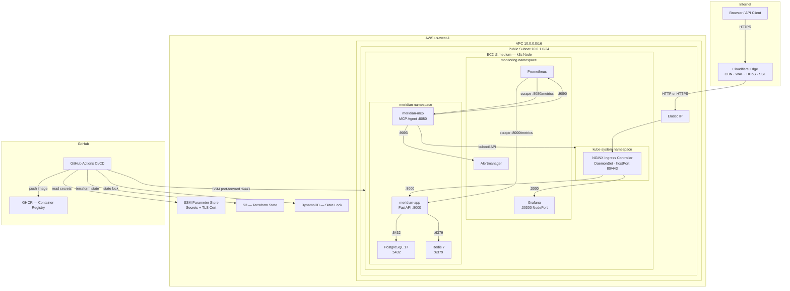
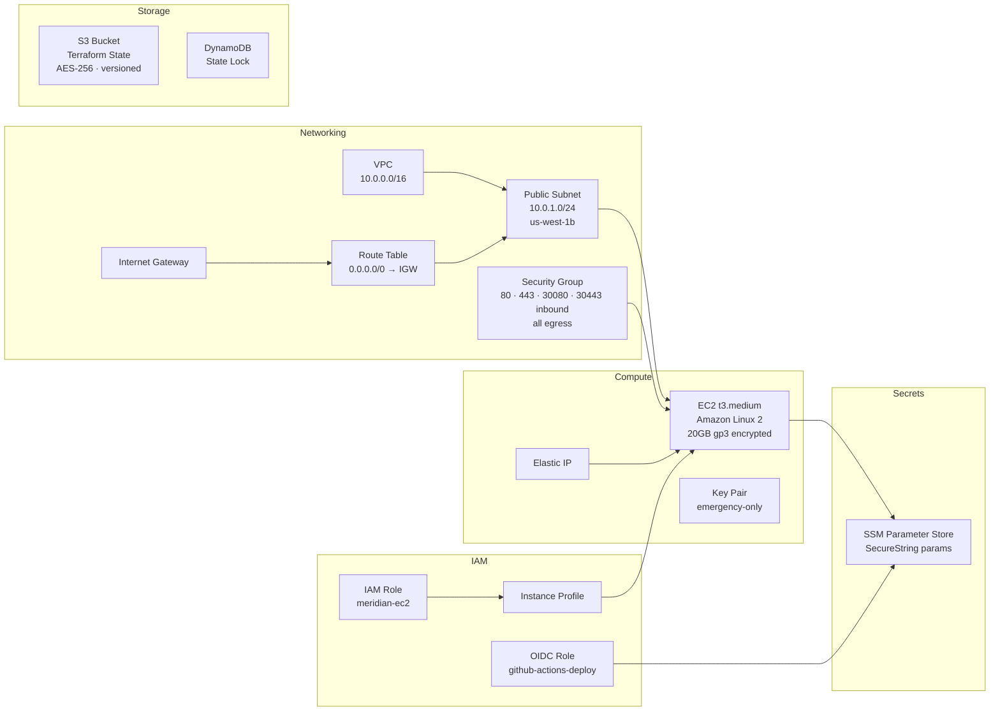
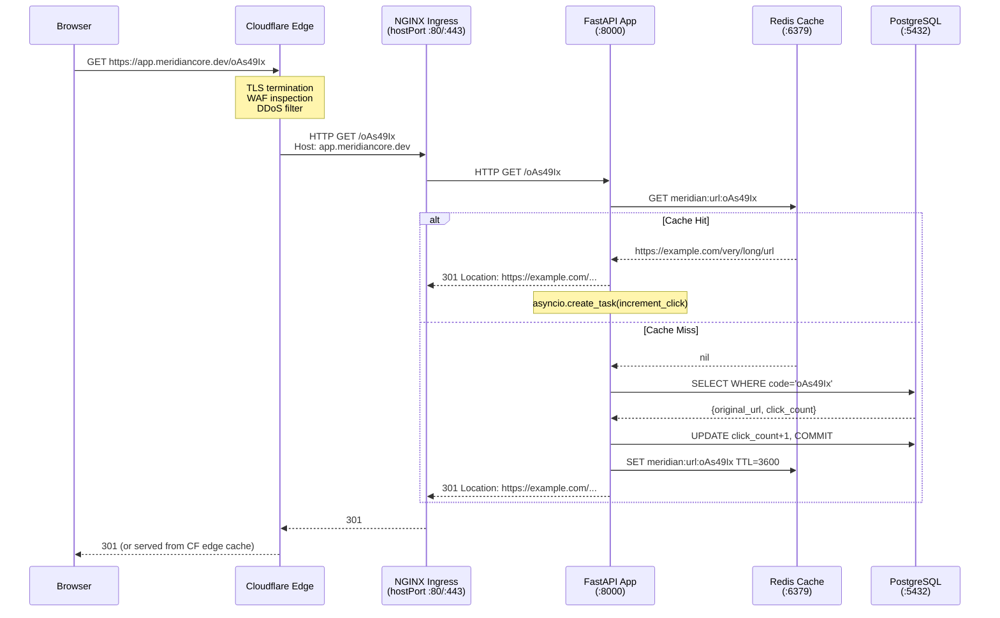
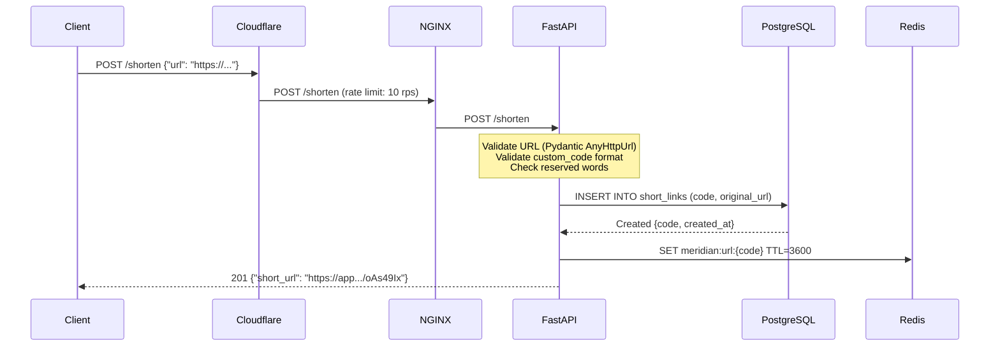
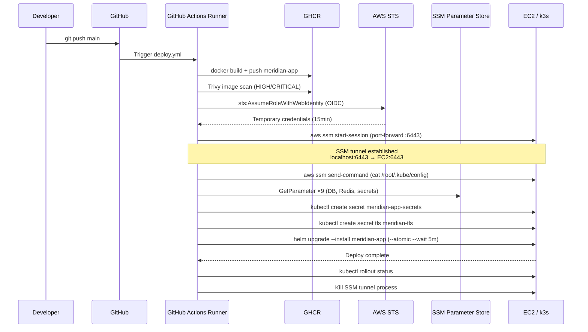
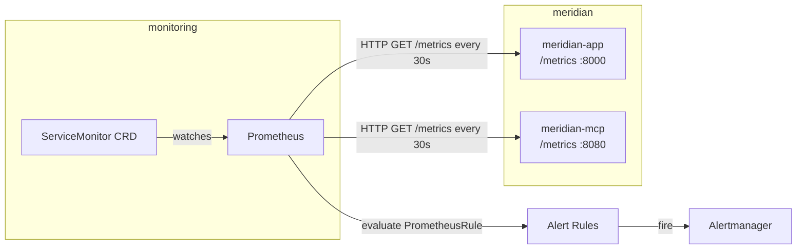
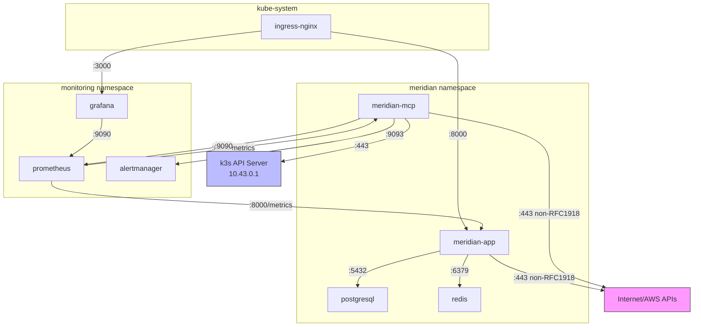
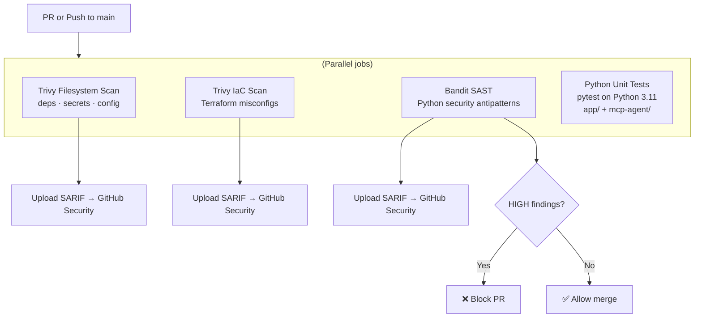
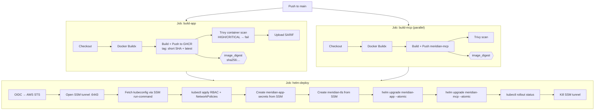
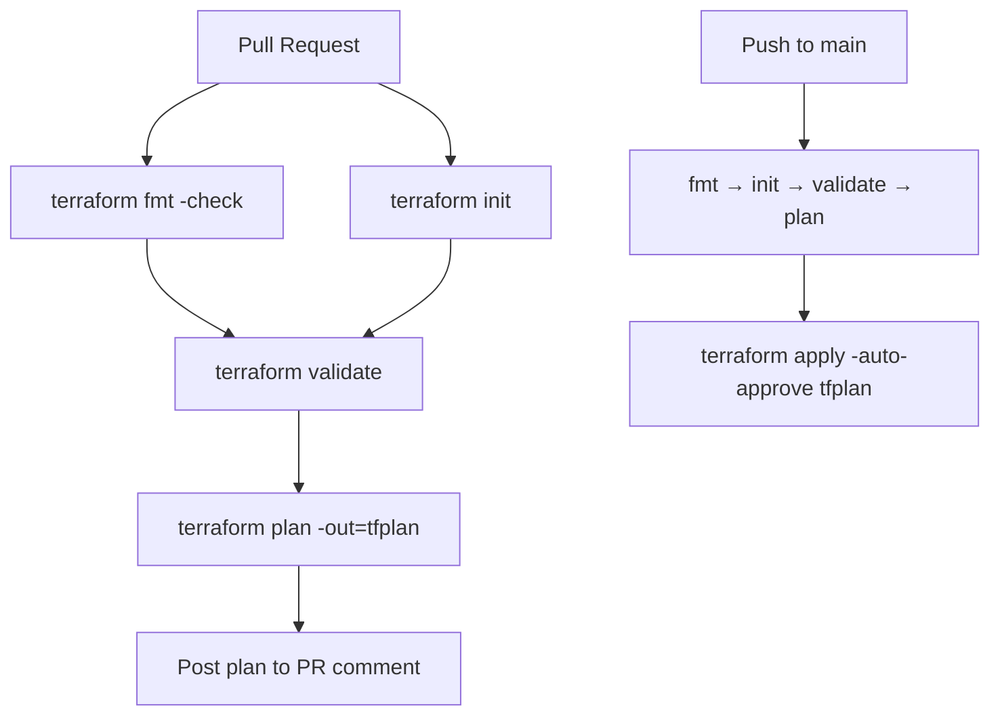

# Meridian Platform — Operations & Architecture Runbook

> **Dual purpose:** This document serves as both an **operational runbook** for day-to-day engineering work and a **technical deep-dive** for understanding every architectural decision made during the platform's design and implementation.

---

## Table of Contents

1. [Executive Summary](#1-executive-summary)
2. [Architecture Overview](#2-architecture-overview)
3. [Infrastructure Design](#3-infrastructure-design)
4. [Kubernetes Architecture](#4-kubernetes-architecture)
5. [Application Architecture](#5-application-architecture)
6. [Communication Flow](#6-communication-flow)
7. [Security Architecture](#7-security-architecture)
8. [CI/CD Pipeline Design](#8-cicd-pipeline-design)
9. [Monitoring and Observability](#9-monitoring-and-observability)
10. [Prerequisites and Initial Setup](#10-prerequisites-and-initial-setup)
11. [First-Time Deployment (Step by Step)](#11-first-time-deployment-step-by-step)
12. [Day-to-Day Operations](#12-day-to-day-operations)
13. [Validation Procedures](#13-validation-procedures)
14. [Troubleshooting Guide](#14-troubleshooting-guide)
15. [Rollback Procedures](#15-rollback-procedures)
16. [Disaster Recovery](#16-disaster-recovery)
17. [Cost Optimization](#17-cost-optimization)
18. [Scalability and High Availability](#18-scalability-and-high-availability)
19. [Known Limitations and Future Improvements](#19-known-limitations-and-future-improvements)

---

## 1. Executive Summary

Meridian is a production-grade **URL shortening service** deployed on AWS using a cloud-native architecture. It accepts a long URL, returns a 7-character cryptographically random short code, and performs fast redirects using a Redis-first caching strategy with PostgreSQL as the source of truth.

**Why this project exists as an architecture demonstration:**

| Concern | Decision | Why |
|---------|----------|-----|
| Compute | Single EC2 t3.medium + k3s | Kubernetes semantics without the cost of EKS; skills transfer directly |
| Container runtime | k3s v1.32 | Lightweight, production-stable; used in edge/IoT/cost-sensitive production clusters |
| CDN/WAF | Cloudflare | Hides origin IP, provides DDoS protection, free WAF, and SSL termination at edge |
| Secrets | AWS SSM Parameter Store | No secrets in code, images, or Helm values; injected at deploy time |
| Auth | OIDC (no static creds) | GitHub Actions assumes an IAM role via OIDC trust; zero long-lived credentials |
| Shell access | SSM Session Manager | Port 22 never opened; audit trail of every session in CloudTrail |
| IaC | Terraform | Industry standard; declarative; remote state with locking |
| Application | FastAPI + Python 3.11 | Async I/O throughout; Pydantic v2 validation; production-ready with uvicorn |

---

## 2. Architecture Overview

### 2.1 High-Level Diagram



### 2.2 Component Inventory

| Component | Technology | Version | Purpose |
|-----------|-----------|---------|---------|
| Web Framework | FastAPI | 0.136.3 | Async HTTP API |
| ASGI Server | Uvicorn | 0.48.0 | Production server |
| Database ORM | SQLAlchemy | 2.0.36 | Async DB access |
| DB Driver | asyncpg | 0.30.0 | Async PostgreSQL |
| Database | PostgreSQL | 17 | Persistent link storage |
| Cache | Redis | 7 | URL redirect cache |
| Validation | Pydantic | 2.9.2 | Request/response models |
| Metrics | prometheus-fastapi-instrumentator | 7.0.0 | Auto Prometheus metrics |
| Container base | distroless/python3-debian12:nonroot | latest | Minimal attack surface |
| Kubernetes | k3s | v1.32.3+k3s1 | Single-node cluster |
| Ingress | NGINX Ingress Controller | 4.12.0 | L7 routing |
| Monitoring | kube-prometheus-stack | 65.1.0 | Prometheus + Grafana + Alertmanager |
| IaC | Terraform | 1.9.8 | Infrastructure provisioning |
| CDN/WAF | Cloudflare | — | Edge security and TLS |
| Secrets | AWS SSM Parameter Store | — | Secret storage |
| Registry | GitHub Container Registry | — | Docker images |

---

## 3. Infrastructure Design

### 3.1 Why a Single EC2 Instance Instead of EKS or ECS

**The decision:** A single EC2 t3.medium running k3s, rather than EKS, ECS Fargate, or a multi-node cluster.

**The reasoning:**

- **Cost:** EKS costs $0.10/hour for the control plane alone (~$72/month) before any worker nodes. A t3.medium is ~$30/month all-in. For a demonstration platform, this is a 60% cost reduction.
- **Skill demonstration:** k3s gives full Kubernetes semantics — RBAC, NetworkPolicy, Ingress, Helm, ServiceMonitor, PrometheusRule CRDs — all of which transfer directly to production EKS/GKE clusters. Using Fargate would obscure this.
- **Single-node is honest:** Rather than running a fake multi-node cluster on a single machine, we acknowledge the constraint explicitly in the HPA values (`autoscaling.enabled: false`) and design defensively around it.
- **k3s in production:** k3s is used in production by companies like Rancher, and at the edge (Retail, IoT, edge computing). It is not a toy.

**Trade-off accepted:** No high availability at the compute layer. A node failure requires waiting for the instance to come back up or for Terraform to recreate it. This is acceptable for a demonstration platform; a production system would use at minimum 3 nodes across 2+ AZs.

### 3.2 AWS Resources



**Key resource decisions:**

**Elastic IP (EIP):** Required so the Cloudflare DNS record (`app.meridiancore.dev → EC2 IP`) doesn't break on instance stop/start or replace. Without an EIP, the instance gets a new public IP every time it restarts, which would require a Terraform apply to update the DNS record.

**gp3 EBS (20GB, encrypted):** gp3 is the current-generation general-purpose SSD. It provides 3000 IOPS and 125 MB/s baseline throughput at lower cost than gp2. Encryption is enabled by default — it protects data at rest (PostgreSQL data files, container images) and satisfies most compliance requirements at zero additional operational cost.

**Security Group — inbound 80/443 only (plus NodePorts for health checks):** Cloudflare proxies all traffic — the EC2 security group only needs to accept connections from Cloudflare's edge (which comes from public IPs). Port 22 is intentionally absent. NodePorts 30080/30443 are retained as a direct-access fallback for health checks from the security group, but Cloudflare connects on port 80/443 via NGINX's hostPort binding.

**Instance Profile (EC2 IAM Role):** The instance profile grants the EC2 instance permission to read SSM parameters (`ssm:GetParameter` scoped to `/meridian/*`). This is the correct pattern: the instance authenticates to AWS via IMDS (IMDSv2, hop limit 1) and assumes its own role — no static credentials required.

**OIDC IAM Role for GitHub Actions:** GitHub Actions authenticates to AWS without any stored AWS credentials by exchanging a GitHub-signed JWT for an AWS STS token. The IAM role trust policy requires the token to come from the specific repository (`repo:TsembA/Meridian:ref:refs/heads/main`), ensuring no other repository or branch can assume the role.

### 3.3 Terraform Design Decisions

**File organization:**

```
infra/terraform/
├── main.tf          # Provider config, S3 state bucket, DynamoDB lock table
├── backend.tf       # Remote state configuration
├── variables.tf     # All input variables (no sensitive defaults)
├── ec2.tf           # EC2 instance, security group, EIP, key pair
├── cloudflare.tf    # DNS records, zone settings, Origin CA certificate
└── scripts/
    ├── bootstrap.sh        # One-time script to create S3+DynamoDB before init
    └── cloud-init.yaml     # EC2 first-boot configuration
```

**Why one `.tf` file per resource group (not one big `main.tf`):** Terraform loads all `.tf` files in a directory as one configuration, so splitting into files is purely organizational. The convention of `ec2.tf`, `cloudflare.tf`, etc. makes it obvious where to look for a given resource without searching.

**Why no Terraform modules here:** Modules add indirection. For a single-environment deployment with ~20 resources, modules would be premature abstraction. If this platform scaled to multiple environments (dev/staging/prod), the same root configuration would be extracted into a module with an environment-specific `tfvars` file.

**Remote state (S3 + DynamoDB):**

```hcl
terraform {
  backend "s3" {
    bucket         = "meridian-platform-tfstate"
    key            = "meridian/terraform.tfstate"
    region         = "us-west-1"
    encrypt        = true
    dynamodb_table = "meridian-platform-tflock"
  }
}
```

State is stored remotely for two reasons: (1) CI/CD pipelines need access to state to plan and apply, and (2) DynamoDB locking prevents two concurrent `terraform apply` runs from corrupting state. The state bucket itself is also managed by Terraform (`aws_s3_bucket.tfstate`), with versioning and AES-256 encryption.

**Bootstrap problem:** The S3 bucket and DynamoDB table must exist _before_ `terraform init` (which configures the backend). This circular dependency is broken by `infra/scripts/bootstrap.sh`, which creates these resources with the AWS CLI before Terraform is ever initialized.

**Provider pinning:**

```hcl
cloudflare = { version = "~> 4.45" }   # v5 has breaking schema changes
aws        = { version = "~> 5.50" }   # Stay within 5.x
tls        = { version = "~> 4.0"  }
```

Provider versions are pinned to prevent surprise upgrades (e.g., the Cloudflare v4→v5 migration changed `value` to `content` in DNS records). The `~>` constraint allows patch releases but not minor version bumps.

### 3.4 Cloud-Init Bootstrap (EC2 First Boot)

When a new EC2 instance launches, `cloud-init` automatically runs `infra/scripts/cloud-init.yaml`. This is a one-time setup that installs and configures everything needed on the node.

**Sequence:**

```
1. OS package updates (curl, jq, git, nc)
2. Write /etc/rancher/k3s/config.yaml (k3s server config)
3. Set SELinux to permissive (k3s-selinux RPM incompatible with AL2)
4. Install k3s v1.32.3+k3s1 (pinned)
5. Wait for k3s node to become Ready (60 attempts × 10s)
6. Copy kubeconfig to /root/.kube/config
7. Install Helm v3.16.3 (pinned)
8. Add Helm repos (prometheus-community, bitnami, ingress-nginx)
9. Create namespaces (meridian, monitoring)
10. Install kube-prometheus-stack v65.1.0
11. Install NGINX ingress controller v4.12.0 with hostPort enabled
```

**Why k3s instead of full Kubernetes:**
- k3s bundles everything (API server, scheduler, controller-manager, etcd replaced by SQLite) into a single ~70MB binary
- Installation takes ~30 seconds vs. 10+ minutes for kubeadm
- Supported production release (Rancher Labs, now CNCF)
- Full compatibility: any `kubectl` command that works on EKS works on k3s

**Why SELinux permissive:**
The `k3s-selinux-1.6-1.el7` RPM requires `selinux-policy-base >= 3.13.1-252`, but Amazon Linux 2 ships `3.13.1-192`. The RPM is incompatible, so k3s cannot start under SELinux enforcing mode. Permissive mode is set as a pragmatic workaround; network-level isolation (Cloudflare WAF, security groups, NetworkPolicies) provides equivalent protection for this single-node cluster.

**Why NGINX ingress with hostPort (not NodePort):**
Cloudflare connects to the EC2 instance's public IP on standard ports 80 and 443. With NodePort mode, the controller would bind to ports 30080/30443 — not the standard ports. The `controller.hostPort.enabled=true` flag causes the NGINX DaemonSet pod to bind directly to host ports 80 and 443, which is what Cloudflare expects. NodePorts (30080/30443) are retained as a diagnostic fallback.

---

## 4. Kubernetes Architecture

### 4.1 Namespace Strategy

```
kube-system         k3s control plane, CoreDNS, NGINX ingress controller
meridian            application workloads (app, postgresql, redis, mcp-agent)
monitoring          observability stack (prometheus, grafana, alertmanager)
```

**Why three namespaces:** Namespaces are the primary unit of isolation in Kubernetes for NetworkPolicies, RBAC, and resource quotas. Separating application workloads from monitoring prevents a Prometheus outage from affecting the application namespace (and vice versa). The `kube-system` namespace is left unmodified — k3s control-plane components have broad access requirements that would conflict with NetworkPolicies.

### 4.2 Workloads

| Workload | Kind | Namespace | Image | Replicas |
|----------|------|-----------|-------|---------|
| meridian-app | Deployment | meridian | ghcr.io/tsemba/meridian-app | 1 |
| meridian-mcp | Deployment | meridian | ghcr.io/tsemba/meridian-mcp | 1 |
| meridian-app-postgresql | StatefulSet | meridian | bitnami/postgresql:17 | 1 |
| meridian-app-redis-master | StatefulSet | meridian | bitnami/redis:7 | 1 |
| ingress-nginx-controller | DaemonSet | kube-system | ingress-nginx/controller | 1 (per node) |
| kube-prometheus-stack | multiple | monitoring | prom/prometheus, grafana/grafana | 1 each |

### 4.3 Rolling Update Strategy

```yaml
strategy:
  type: RollingUpdate
  rollingUpdate:
    maxUnavailable: 0   # Never bring the old pod down before the new one is Ready
    maxSurge: 1         # Spin up one extra pod during the transition
```

**Why `maxUnavailable: 0`:** On a single-node cluster with a single replica, setting `maxUnavailable: 1` would cause a brief outage during every deploy (old pod terminated, new pod starting). With `maxUnavailable: 0, maxSurge: 1`, Kubernetes creates the new pod first, waits for its readiness probe to pass, then terminates the old pod — achieving zero-downtime deploys even on a single replica.

**Init container (wait-for-postgres):**

```yaml
initContainers:
  - name: wait-for-postgres
    image: busybox:1.36.1
    command:
      - sh
      - -c
      - until nc -z meridian-app-postgresql 5432; do sleep 2; done
```

The application will fail immediately on startup if PostgreSQL isn't available (SQLAlchemy raises on `init_db()`). The init container prevents the main container from starting until the database service is reachable, avoiding CrashLoopBackOff during initial deployment or database restarts.

### 4.4 Ingress Routing

```
Browser → Cloudflare → EC2 :80/:443 → NGINX Ingress → meridian-app Service :80 → Pod :8000
                                                      → Grafana Service :80 → Pod :3000
```

The NGINX ingress controller terminates at the host level (hostPort binding) and routes based on the `Host` header:

| Host | Backend |
|------|---------|
| `app.meridiancore.dev` | `meridian-app` Service port 80 → container port 8000 |
| `grafana.meridiancore.dev` | `kube-prometheus-stack-grafana` Service |

**Why no cert-manager:** TLS is terminated at Cloudflare. The Cloudflare edge holds the publicly-trusted certificate; the connection from Cloudflare to the origin uses a Cloudflare Origin CA certificate (signed by Cloudflare's internal CA, trusted only by Cloudflare). This eliminates the need for cert-manager, Let's Encrypt rate limit management, and certificate rotation logic on the cluster.

### 4.5 Resource Limits

```yaml
resources:
  requests:
    cpu: "100m"
    memory: "128Mi"
  limits:
    cpu: "500m"
    memory: "256Mi"
```

**Why conservative limits:** The t3.medium has 2 vCPU and 4 GB RAM, shared across the application, PostgreSQL, Redis, and the monitoring stack. Tight limits prevent any single workload from starving others. `requests` determine scheduling (guaranteed resources); `limits` prevent runaway processes. The ratio of 5× CPU limit to request is intentional — FastAPI can burst to handle traffic spikes without being throttled in normal conditions.

---

## 5. Application Architecture

### 5.1 FastAPI Service Design

```
src/
├── main.py      — FastAPI app, route handlers, lifespan context manager
├── models.py    — Pydantic request/response models, input validation
├── database.py  — SQLAlchemy async engine, ORM model, session factory
├── cache.py     — Redis async client wrapper with graceful degradation
├── config.py    — Pydantic Settings, reads from environment variables
└── logger.py    — Structured JSON formatter, configures root logger
```

**Lifespan context manager:** FastAPI's lifespan API (replacing the deprecated `@app.on_event`) initializes shared resources on startup and tears them down on shutdown:

```python
@asynccontextmanager
async def lifespan(app: FastAPI) -> AsyncGenerator[None, None]:
    engine = create_db_engine(settings)
    await init_db(engine)                              # Create tables if not exist
    app.state.session_factory = create_session_factory(engine)
    cache = CacheClient(host=settings.redis_host, ...)
    app.state.cache = cache
    yield                                              # Application serves requests
    await cache.close()
    await engine.dispose()                             # Graceful shutdown
```

Resources attached to `app.state` are accessible in all route handlers via `request.app.state.*`. This avoids module-level globals that complicate testing.

### 5.2 Data Model

```
short_links table:
  code        VARCHAR(20)  PRIMARY KEY     — Short code (7 random chars, or custom up to 20)
  original_url TEXT        NOT NULL        — The destination URL
  click_count  INTEGER     DEFAULT 0       — Redirects served (incremented on every hit)
  created_at   TIMESTAMPTZ DEFAULT NOW()   — DB-side timestamp (avoids app/DB clock skew)
  updated_at   TIMESTAMPTZ DEFAULT NOW()   — Updated by ORM on commit
```

**Why `code` as primary key (not a surrogate integer):** The code is the natural primary key — it's unique, immutable, and the access pattern is always "look up by code." A surrogate integer PK would require an extra index. Using the code directly makes lookups a single B-tree index scan with no join.

**Why `server_default=func.now()` instead of Python's `datetime.now()`:** `server_default` means PostgreSQL sets the timestamp using its own clock (`NOW()`). If the application pod and the PostgreSQL pod are on different nodes (possible in multi-node clusters), their system clocks may differ by milliseconds. DB-side timestamps eliminate this skew.

### 5.3 Cache Strategy

```
Redirect request for code X:
  1. Redis GET meridian:url:X
     → Hit:  return 301, fire-and-forget click increment
     → Miss: fall through to database

  2. PostgreSQL SELECT WHERE code = X
     → Found:  increment click_count, commit, back-fill Redis (TTL 3600s), return 301
     → Not found: 404
```

**Why Redis-first:** URL redirects are the hot path. Every redirect hit is a database round-trip under pure PostgreSQL mode. Redis reduces this to a sub-millisecond in-memory lookup for the most frequent codes. Cache misses fall through transparently — Redis is an optimization, not a requirement.

**Why TTL 3600s (1 hour):** Long enough to serve high-traffic URLs without frequent cache misses. Short enough that a deleted or modified URL won't serve stale data indefinitely. Redis auth is disabled — access is restricted by NetworkPolicy to the application pods only.

**Graceful degradation:** All cache operations catch exceptions and return safe defaults (None for get, no-op for set). If Redis crashes, the application continues serving from PostgreSQL. The `/health` endpoint reports cache status separately from the overall health status — the app is considered "degraded" (not down) when only Redis is unavailable.

### 5.4 Short Code Generation

```python
_CODE_ALPHABET = string.ascii_letters + string.digits  # 62 chars, excludes 0/O/l/1
_CODE_LENGTH = 7

def _generate_code() -> str:
    return "".join(secrets.choice(_CODE_ALPHABET) for _ in range(_CODE_LENGTH))
```

**Why `secrets.choice` not `random.choice`:** `random` is seeded with system time and is not cryptographically secure — an attacker who knows the approximate creation time could predict future codes. `secrets.choice` uses the OS CSPRNG (`/dev/urandom`) and is suitable for generating tokens, codes, and secrets.

**62^7 = 3.5 trillion unique codes.** The collision probability for any two codes is negligible in practice. The code generates up to 5 candidates if a collision occurs (astronomically unlikely) and returns 503 if all 5 collide.

### 5.5 Structured Logging

All log output is newline-delimited JSON:

```json
{"timestamp": "2026-05-31T12:00:00.000Z", "level": "INFO", "logger": "src.main",
 "message": "Short URL created", "code": "oAs49Ix", "url": "https://example.com/..."}
```

**Why JSON logs:** JSON logs are directly ingestible by CloudWatch Logs Insights, Loki, Datadog, and any structured log aggregator without a Grok parser. Each `extra={}` dict passed to the logger becomes top-level fields in the JSON, making log-based alerting and filtering trivial.

The logger suppresses verbose output from third-party libraries (`uvicorn.access`, `asyncpg`, `sqlalchemy.engine`) to avoid noise in production, while preserving them in DEBUG mode for troubleshooting.

### 5.6 MCP Diagnostic Agent

The `meridian-mcp` service is a **Model Context Protocol** server that exposes six read-only diagnostic tools to AI assistants (Claude Desktop, claude CLI):

| Tool | What it does |
|------|-------------|
| `get_pod_status` | List pods in a namespace with phase, readiness, restart count |
| `get_recent_logs` | Tail N lines from a specific pod |
| `get_active_alerts` | Query Alertmanager for firing alerts |
| `get_node_metrics` | Query Prometheus for CPU/memory/disk |
| `get_db_connectivity` | TCP reachability test to PostgreSQL |
| `get_deployment_history` | Recent GitHub Actions workflow runs |

**Why read-only:** The MCP agent has a ServiceAccount with minimal RBAC — it can list and get pods and read pod logs, but cannot modify any resource. All tools are read-only by design; no `kubectl apply`, `kubectl delete`, or any mutation is possible through the agent.

**Audit logging:** Every tool invocation is written to an audit log (JSONL format) before and after execution, including the tool name, arguments, and result status. This provides an audit trail of every diagnostic action taken via the AI assistant.

**Why ClusterIP (not exposed to internet):** The MCP server communicates via `stdio` transport when connected to an AI client over SSM port-forward. It is a `ClusterIP` service — not reachable from outside the cluster. This prevents unauthorized access to diagnostic information.

---

## 6. Communication Flow

### 6.1 End-to-End Request Path (URL Redirect)



### 6.2 URL Creation Flow



### 6.3 CI/CD Deploy Flow



### 6.4 Metrics Scraping Flow



The `ServiceMonitor` CRD tells the Prometheus Operator where to scrape metrics. It must have the label `release: kube-prometheus-stack` to be picked up by the operator's selector.

---

## 7. Security Architecture

### 7.1 Defense in Depth

```
Layer 1: Cloudflare Edge
  - DDoS protection (L3/L4/L7)
  - WAF rules (OWASP top 10, bot detection)
  - Browser integrity check
  - Rate limiting at edge
  - TLS 1.2+ minimum, TLS 1.3 enabled
  - HSTS with 1-year max-age

Layer 2: AWS Security Group
  - Inbound: only 80, 443, 30080, 30443 (no SSH/22)
  - Outbound: unrestricted (AWS APIs, GHCR, OS updates)

Layer 3: Kubernetes NetworkPolicies
  - Default-deny all ingress + egress in meridian + monitoring namespaces
  - Explicit allow rules per workload and direction
  - DNS egress explicitly allowed (not included in default-deny)

Layer 4: RBAC
  - ServiceAccounts per workload
  - automountServiceAccountToken: false
  - Minimal permissions (read-only, scoped to exact resource names)

Layer 5: Container Hardening
  - Non-root user (UID 65532)
  - readOnlyRootFilesystem: true
  - capabilities: drop: [ALL]
  - allowPrivilegeEscalation: false
  - distroless runtime (no shell, no package manager)

Layer 6: Secret Management
  - No secrets in code, images, or Helm values
  - SSM SecureString → k8s Secret at deploy time
  - App reads from env vars (injected from Secret)

Layer 7: Compute
  - IMDSv2 required (http_tokens: required)
  - IMDS hop limit = 1 (containers cannot reach metadata service)
  - No SSH — SSM Session Manager only
  - EBS encrypted (AES-256)
```

### 7.2 Secret Management Lifecycle

```
Terraform provisions SSM SecureString parameters:
  /meridian/db/host         → meridian-app-postgresql.meridian.svc.cluster.local
  /meridian/db/port         → 5432
  /meridian/db/name         → meridian
  /meridian/db/user         → meridian_app
  /meridian/db/password     → <generated>  (SecureString, KMS encrypted)
  /meridian/redis/host      → meridian-app-redis-master.meridian.svc.cluster.local
  /meridian/redis/port      → 6379
  /meridian/app/secret-key  → <generated>  (SecureString)
  /meridian/app/base-url    → https://app.meridiancore.dev
  /meridian/tls/cert        → (Cloudflare Origin CA cert PEM)
  /meridian/tls/key         → (Private key PEM, SecureString)

At deploy time (GitHub Actions):
  1. Actions assumes OIDC role (temporary credentials, 15min TTL)
  2. Actions reads SSM parameters via aws ssm get-parameter
  3. Actions creates k8s Secret:
     kubectl create secret generic meridian-app-secrets \
       --from-literal=DB_HOST=... \
       --from-literal=DB_PASSWORD=... \
       ... \
       --dry-run=client -o yaml | kubectl apply -f -
  4. Actions creates TLS secret:
     kubectl create secret tls meridian-tls \
       --cert=/tmp/tls.crt --key=/tmp/tls.key \
       --dry-run=client -o yaml | kubectl apply -f -

At runtime:
  - Pod reads from envFrom: - secretRef: meridian-app-secrets
  - App reads DB_HOST, DB_PASSWORD, etc. from environment variables
  - App never calls AWS APIs at runtime (no boto3, no IMDS)
```

**Why SSM instead of k8s Secrets directly:** k8s Secrets are base64-encoded (not encrypted) by default in etcd unless encryption at rest is configured. SSM SecureString parameters are encrypted with KMS. The workflow ensures secrets are decrypted in-memory in the CI runner (an ephemeral VM) and written to a k8s Secret — which is the standard distribution mechanism within the cluster.

**Why IMDS hop limit = 1:** With a hop limit of 1, the IMDSv2 token request (which uses TTL=1) cannot be forwarded from a container to the metadata endpoint. This prevents a compromised container from stealing the EC2 instance's IAM credentials. The application does not need IMDS access — all secrets come from env vars.

### 7.3 Network Policies (Zero-Trust Model)



**Why block RFC-1918 in external egress rules:** The `allow-app-to-aws-apis` and `allow-mcp-to-external-https` policies allow outbound HTTPS but explicitly exclude `10.0.0.0/8`, `172.16.0.0/12`, and `192.168.0.0/16`. This prevents SSRF (Server-Side Request Forgery) attacks where a compromised application could reach other internal services, the Kubernetes API, or other pods using their cluster-internal IPs.

### 7.4 Container Hardening

```yaml
podSecurityContext:
  runAsNonRoot: true
  runAsUser: 65532      # distroless nonroot UID
  runAsGroup: 65532
  fsGroup: 65532

containerSecurityContext:
  allowPrivilegeEscalation: false
  readOnlyRootFilesystem: true
  capabilities:
    drop: ["ALL"]
```

**Why distroless:** The `gcr.io/distroless/python3-debian12:nonroot` image contains only the Python runtime and its system dependencies — no shell (`sh`, `bash`), no package manager (`apt`, `pip`), no coreutils. An attacker who gains code execution inside the container has no tools to pivot from. The image is maintained by Google and regularly rebuilt with security patches.

**Why `readOnlyRootFilesystem: true`:** Makes the container filesystem immutable at runtime. Any attempt to write to the filesystem (except explicitly mounted `emptyDir` volumes) fails immediately. The two `emptyDir` mounts (`/tmp` and `/app/.cache`) are the only writable paths, and they're in-memory and ephemeral.

**Why `capabilities: drop: ["ALL"]`:** Linux capabilities are fine-grained privilege flags (e.g., `CAP_NET_ADMIN`, `CAP_SYS_ADMIN`). Dropping all capabilities means the process runs with zero elevated privileges — it cannot bind privileged ports, modify network interfaces, or perform any system administration operations. FastAPI on port 8000 doesn't need any of these.

### 7.5 CI Security Scanning

Three scanning tools run on every PR and push to main:

| Tool | Scope | What it checks |
|------|-------|---------------|
| Trivy (fs) | Repository filesystem | Dependency CVEs, hardcoded secrets, misconfiguration |
| Trivy (IaC) | `infra/terraform/` | Terraform resource misconfigurations |
| Trivy (container) | Built Docker images | OS and package CVEs in the final image |
| Bandit | `app/src/` + `mcp-agent/src/` | Python SAST: SQL injection, command injection, insecure crypto |

All results are uploaded to GitHub Security tab as SARIF. HIGH/CRITICAL findings fail the workflow. Accepted risks are suppressed via `.trivyignore`.

---

## 8. CI/CD Pipeline Design

### 8.1 Workflow Overview

Three GitHub Actions workflows run on different triggers:

```
security.yml  → Every PR + push to main
deploy.yml    → Push to main touching app/, mcp-agent/, k8s/charts/, .github/workflows/deploy.yml
terraform.yml → Push to main touching infra/terraform/ or .github/workflows/terraform.yml
```

### 8.2 Security Pipeline (`security.yml`)



**Why scan on every push (not just PR):** Direct pushes to main (hotfixes, emergency changes) bypass PR checks. Running security.yml on push ensures even direct main branch pushes are scanned and results are visible in the Security tab.

### 8.3 Deploy Pipeline (`deploy.yml`)



**Key design decisions:**

**`--atomic` flag on helm upgrade:** If any resource fails to become healthy within the timeout (5 minutes), Helm automatically rolls back to the previous release. This is critical for zero-downtime deploys — a failed image (bad readiness probe, CrashLoopBackOff) won't replace the running healthy version.

**Image digest pinning:** The deploy command uses `--set image.digest=sha256:...` (the image digest from the build step) rather than a tag. Tags are mutable — `latest` can be overwritten. Digests are immutable — the cluster always runs exactly the image that was scanned and approved by Trivy.

**SSM tunnel instead of public API server:** The k3s API server is bound to `127.0.0.1:6443` on the EC2 instance (by Kubernetes TLS SAN config). It is not reachable from the internet. GitHub Actions connects via `aws ssm start-session --document-name AWS-StartPortForwardingSession`, which creates an encrypted WebSocket tunnel through the SSM service — effectively a VPN session without opening any inbound ports.

**RBAC/NetworkPolicy applied before Helm:** ServiceAccounts referenced in pod specs must exist before the pod starts. Applying RBAC manifests before `helm upgrade` ensures the `meridian-app` ServiceAccount is present when the deployment controller creates pods. Without this ordering, a first-time deploy would fail with "serviceaccount not found."

### 8.4 Terraform Pipeline (`terraform.yml`)



**Why plan on PR, apply on merge:** Showing the Terraform plan as a PR comment lets reviewers see exactly what infrastructure changes will be made before approving. The plan is saved as `tfplan` and the same artifact is applied — ensuring `apply` executes exactly what was reviewed, not a re-planned version.

**Why `cancel-in-progress: true` for Terraform but `false` for deploy:** Concurrent Terraform applies against the same state are dangerous (state corruption). DynamoDB locking prevents two applies from running simultaneously, but cancelling the older run is cleaner than letting them queue. For deploy jobs, cancelling an in-flight Helm upgrade could leave the cluster in a partially-updated state, so `cancel-in-progress: false` lets the current deploy finish.

---

## 9. Monitoring and Observability

### 9.1 Prometheus Stack

kube-prometheus-stack 65.1.0 includes:
- **Prometheus Operator** — manages Prometheus instances via CRDs
- **Prometheus** — metrics collection, alerting rules evaluation
- **Grafana** — dashboards and visualization
- **Alertmanager** — alert routing and deduplication
- **kube-state-metrics** — Kubernetes object metrics (pod status, deployments)
- **node-exporter** — OS-level metrics (CPU, memory, disk, network)

**Why kube-prometheus-stack over individual charts:** The stack chart wires all components together with the correct ServiceMonitor selectors, RBAC, and default dashboards. Installing them individually requires manual configuration of each component's discovery and scraping — significant operational overhead.

### 9.2 ServiceMonitor

```yaml
apiVersion: monitoring.coreos.com/v1
kind: ServiceMonitor
metadata:
  labels:
    release: kube-prometheus-stack   # MUST match Prometheus Operator ruleSelector
spec:
  selector:
    matchLabels:
      app.kubernetes.io/name: meridian-app
  endpoints:
    - path: /metrics
      interval: 30s
```

**The critical label:** The Prometheus Operator discovers ServiceMonitors by label selector. If `release: kube-prometheus-stack` is missing, Prometheus will not scrape the application metrics. This label must match the `serviceMonitorSelector` in the Prometheus CRD (set by the Helm chart).

**What's exposed at `/metrics`:** The `prometheus-fastapi-instrumentator` auto-instruments all FastAPI routes with three metric families:
- `http_requests_total` — counter by method, path, status code
- `http_request_duration_seconds` — histogram for latency percentiles (p50/p95/p99)
- `http_request_size_bytes`, `http_response_size_bytes` — payload sizes

### 9.3 Alert Rules

Four alert groups are defined in `k8s/monitoring/alerts/meridian-alerts.yaml`:

| Alert | Expression | Threshold | Severity |
|-------|-----------|----------|---------|
| MeridianPodNotReady | `kube_pod_status_ready == 0` | 5 min | critical |
| MeridianPodCrashLooping | restarts > 3 in 15m | 5 min | critical |
| MeridianDeploymentUnavailable | available replicas == 0 | 3 min | critical |
| MeridianHighErrorRate | 5xx rate > 5% | 5 min | warning |
| MeridianCriticalErrorRate | 5xx rate > 20% | 2 min | critical |
| MeridianHighP95Latency | p95 latency > 1s | 5 min | warning |
| MeridianCriticalP99Latency | p99 latency > 5s | 5 min | critical |
| MeridianNodeHighCPU | CPU > 85% | 10 min | warning |
| MeridianNodeLowMemory | available memory < 15% | 5 min | critical |
| MeridianDiskSpaceLow | disk usage > 80% | 5 min | warning |

### 9.4 Accessing Grafana

Grafana is exposed as a NodePort service (30300) and is accessible via SSM port-forward:

```bash
# From your local machine
aws ssm start-session \
  --target $(aws ec2 describe-instances \
    --filters "Name=tag:Name,Values=meridian-ec2" \
    --query "Reservations[0].Instances[0].InstanceId" --output text) \
  --document-name AWS-StartPortForwardingSession \
  --parameters '{"portNumber":["30300"],"localPortNumber":["3000"]}'

# Then open http://localhost:3000
# Default credentials: admin / (from SSM /meridian/grafana/admin-password)
```

---

## 10. Prerequisites and Initial Setup

### 10.1 Required Tools

| Tool | Minimum Version | Purpose |
|------|----------------|---------|
| Terraform | 1.9.x | Infrastructure provisioning |
| AWS CLI | v2 | Cloud operations, SSM sessions |
| AWS Session Manager Plugin | latest | SSM port-forwarding |
| kubectl | 1.32.x | Cluster operations (optional — for local debugging) |
| Helm | 3.16.3 | Chart management (optional — CI handles this) |
| Docker | 24+ | Local development and image building |
| docker compose | v2 | Local development environment |
| git | any | Version control |

### 10.2 Required Accounts and Permissions

- **AWS Account** with admin access (for initial setup; CI uses a scoped role)
- **Cloudflare Account** with the domain configured as a zone
- **GitHub Account** with a repository (public or private with Packages enabled)

### 10.3 GitHub Repository Secrets

These must be configured in **Settings → Secrets and Variables → Actions**:

| Secret | Description |
|--------|-------------|
| `AWS_ROLE_TO_ASSUME` | ARN of the OIDC IAM role (e.g., `arn:aws:iam::123456789:role/github-actions-deploy`) |
| `AWS_REGION` | AWS region (e.g., `us-west-1`) |
| `CF_ZONE_ID` | Cloudflare Zone ID from the zone overview page |
| `CF_API_TOKEN` | Cloudflare API token with DNS:Edit + Zone:Read + Zone:SSL and Certificates:Edit |
| `DOMAIN_NAME` | Root domain (e.g., `meridiancore.dev`) |
| `APP_HOSTNAME` | Full app subdomain (e.g., `app.meridiancore.dev`) |
| `EC2_SSH_PUBLIC_KEY` | SSH public key for the EC2 key pair (emergency break-glass only) |

### 10.4 SSM Parameters to Create

Before the first deploy, create these parameters in AWS SSM Parameter Store:

```bash
# Database
aws ssm put-parameter --name /meridian/db/host --type String \
  --value "meridian-app-postgresql.meridian.svc.cluster.local"
aws ssm put-parameter --name /meridian/db/port --type String --value "5432"
aws ssm put-parameter --name /meridian/db/name --type String --value "meridian"
aws ssm put-parameter --name /meridian/db/user --type String --value "meridian_app"
aws ssm put-parameter --name /meridian/db/password --type SecureString \
  --value "$(openssl rand -base64 32)"

# Redis
aws ssm put-parameter --name /meridian/redis/host --type String \
  --value "meridian-app-redis-master.meridian.svc.cluster.local"
aws ssm put-parameter --name /meridian/redis/port --type String --value "6379"

# Application
aws ssm put-parameter --name /meridian/app/secret-key --type SecureString \
  --value "$(openssl rand -hex 32)"
aws ssm put-parameter --name /meridian/app/base-url --type String \
  --value "https://app.meridiancore.dev"

# Grafana (used by cloud-init)
aws ssm put-parameter --name /meridian/grafana/admin-password --type SecureString \
  --value "$(openssl rand -base64 24)"
```

*The TLS parameters (`/meridian/tls/cert` and `/meridian/tls/key`) are created by Terraform automatically.*

---

## 11. First-Time Deployment (Step by Step)

### Phase 1: Bootstrap Terraform State Backend

```bash
cd infra/scripts
# Creates the S3 bucket and DynamoDB table needed for Terraform's remote backend
bash bootstrap.sh
```

This is a one-time operation. The script uses the AWS CLI (not Terraform) to avoid the circular dependency of Terraform needing a backend that doesn't exist yet.

### Phase 2: Initialize and Apply Terraform

```bash
cd infra/terraform

# Initialize — downloads providers, configures remote backend
terraform init

# Review what will be created (10-15 resources)
terraform plan \
  -var="github_org=YOUR_GITHUB_USERNAME" \
  -var="cloudflare_zone_id=$CF_ZONE_ID" \
  -var="cloudflare_api_token=$CF_API_TOKEN" \
  -var="domain_name=meridiancore.dev" \
  -var="ssh_public_key=$(cat ~/.ssh/id_ed25519.pub)"

# Apply — ~5 minutes (EC2 takes longest)
terraform apply [same vars]
```

**What Terraform creates:**
- VPC, subnet, internet gateway, route table
- Security group (ports 80, 443, 30080, 30443 inbound)
- EC2 t3.medium with 20GB gp3 encrypted EBS
- Elastic IP attached to EC2
- IAM role + instance profile for the EC2
- IAM role for GitHub Actions OIDC
- Cloudflare DNS records (`app`, `grafana`)
- Cloudflare zone settings (TLS, WAF, HSTS)
- Cloudflare Origin CA certificate
- SSM parameters for TLS cert and key
- S3 bucket + DynamoDB table for Terraform state (already exist from bootstrap)

### Phase 3: Wait for Cloud-Init to Complete (~15 minutes)

```bash
# Get the instance ID
INSTANCE_ID=$(aws ec2 describe-instances \
  --filters "Name=tag:Name,Values=meridian-ec2" "Name=instance-state-name,Values=running" \
  --query "Reservations[0].Instances[0].InstanceId" --output text)

# Open an SSM shell session
aws ssm start-session --target $INSTANCE_ID

# Inside the session — check cloud-init progress
tail -f /var/log/cloud-init-output.log
# Wait for: "Meridian k3s bootstrap complete."

# Verify k3s is running
k3s kubectl get nodes    # Should show: Ready
k3s kubectl get pods -n kube-system   # All should be Running
k3s kubectl get pods -n monitoring    # kube-prometheus-stack pods should be Running
```

### Phase 4: Create SSM Parameters

Run the parameter creation commands from Section 10.4 above.

### Phase 5: Configure GitHub Secrets

Add all secrets from Section 10.3 to the GitHub repository settings.

### Phase 6: Update Cloudflare API Token

Ensure the Cloudflare API token has the `Zone:SSL and Certificates:Edit` permission (required for the Origin CA certificate created by Terraform).

### Phase 7: Push to main

```bash
git push origin main
```

This triggers both `terraform.yml` (which handles Origin Certificate creation if not yet done) and `deploy.yml`:

1. `deploy.yml` builds the Docker images, scans them, and deploys via Helm.
2. Monitor progress in GitHub Actions → Actions tab.

### Phase 8: Validate

```bash
# Test the public endpoint
curl -v https://app.meridiancore.dev/health
# Expected: {"status":"healthy","version":"1.0.0","database":"healthy","cache":"healthy",...}

# Create a short URL
curl -X POST https://app.meridiancore.dev/shorten \
  -H "Content-Type: application/json" \
  -d '{"url": "https://example.com/test"}'
# Expected: {"short_code":"...","short_url":"https://app.meridiancore.dev/..."}

# Test redirect
curl -I https://app.meridiancore.dev/{short_code}
# Expected: 301 Location: https://example.com/test
```

### Phase 9: Switch Cloudflare to Full (Strict) TLS

After validating Phase 8 succeeds:

1. Edit `infra/terraform/cloudflare.tf` line `ssl = "flexible"` → `ssl = "strict"`
2. Commit and push → `terraform.yml` auto-applies

---

## 12. Day-to-Day Operations

### 12.1 Deploy an Application Code Change

```bash
# 1. Make changes in app/ or mcp-agent/
# 2. Run locally first
docker compose up --build

# 3. Commit and push
git add app/
git commit -m "feat: describe your change"
git push

# 4. Monitor in GitHub Actions
# deploy.yml triggers automatically — watch the helm-deploy job
# If Trivy finds new HIGH CVEs in your dependency change, the build will fail
```

### 12.2 Deploy an Infrastructure Change

```bash
# 1. Edit infra/terraform/*.tf
# 2. Preview locally
cd infra/terraform
terraform plan -var="..." ...

# 3. Commit and push
git add infra/terraform/
git commit -m "infra: describe change"
git push

# 4. terraform.yml runs automatically
# Review the plan in the GitHub Actions log or as a PR comment
# apply runs automatically on push to main
```

### 12.3 Access the Cluster Shell

```bash
INSTANCE_ID=$(aws ec2 describe-instances \
  --filters "Name=tag:Name,Values=meridian-ec2" "Name=instance-state-name,Values=running" \
  --query "Reservations[0].Instances[0].InstanceId" --output text)

aws ssm start-session --target $INSTANCE_ID
# Now you have a shell on the EC2 node
# kubectl is available as k3s kubectl or just kubectl after kubeconfig is in /root/.kube/config
```

### 12.4 Forward kubectl to Your Laptop

```bash
aws ssm start-session \
  --target $INSTANCE_ID \
  --document-name AWS-StartPortForwardingSession \
  --parameters '{"portNumber":["6443"],"localPortNumber":["6443"]}'

# In another terminal — copy kubeconfig from node
aws ssm send-command \
  --instance-ids $INSTANCE_ID \
  --document-name "AWS-RunShellScript" \
  --parameters 'commands=["cat /root/.kube/config"]' \
  --query "Command.CommandId" --output text
# Then retrieve with: aws ssm get-command-invocation --command-id <CMD_ID> --instance-id <INSTANCE_ID>

export KUBECONFIG=/path/to/kubeconfig
kubectl get pods -n meridian
```

### 12.5 Check Application Logs

```bash
# Via SSM session on the node
kubectl logs -n meridian deployment/meridian-app --tail=100 -f

# Or run a debug pod with logs access
kubectl run debug --image=busybox --rm -it --namespace meridian -- sh
```

### 12.6 Run a Database Query

```bash
# From the EC2 node via SSM
kubectl exec -n meridian \
  $(kubectl get pod -n meridian -l app.kubernetes.io/name=postgresql -o name | head -1) \
  -- psql -U meridian_app -d meridian -c "SELECT count(*) FROM short_links;"
```

---

## 13. Validation Procedures

### 13.1 Post-Deploy Health Checks

```bash
BASE="https://app.meridiancore.dev"

# 1. Health endpoint
curl -sf "$BASE/health" | python3 -m json.tool
# Must show: "status": "healthy", "database": "healthy", "cache": "healthy"

# 2. Create a link
RESP=$(curl -sf -X POST "$BASE/shorten" \
  -H "Content-Type: application/json" \
  -d '{"url":"https://example.com/runbook-test"}')
echo $RESP | python3 -m json.tool
SHORT=$(echo $RESP | python3 -c "import sys,json; print(json.load(sys.stdin)['short_code'])")

# 3. Test redirect
HTTP_CODE=$(curl -so /dev/null -w "%{http_code}" -L "$BASE/$SHORT")
echo "Redirect HTTP code: $HTTP_CODE"  # Must be 200 (after redirect to example.com)

# 4. Stats endpoint
curl -sf "$BASE/stats" | python3 -m json.tool

# 5. Kubernetes health
kubectl get pods -n meridian
# All pods must show STATUS=Running and READY=1/1
```

### 13.2 Prometheus Targets

1. Open Grafana: forward port 30300 via SSM (see Section 12.4)
2. Navigate to **Status → Targets**
3. Verify `meridian-app` and `meridian-mcp` show **UP** state

### 13.3 Alert Rule Status

```bash
# Check PrometheusRule was picked up
kubectl get prometheusrule -n monitoring
# Should show: meridian-platform-alerts

# Verify no alerts are firing
kubectl exec -n monitoring \
  $(kubectl get pod -n monitoring -l app.kubernetes.io/name=alertmanager -o name) \
  -- wget -qO- http://localhost:9093/api/v2/alerts | python3 -m json.tool
```

---

## 14. Troubleshooting Guide

### 14.1 Application Pod in CrashLoopBackOff

```bash
# Get logs from the crashing pod
kubectl logs -n meridian deployment/meridian-app --previous
# Look for: missing env vars, database connection failure, import errors

# Check if the secret exists
kubectl get secret meridian-app-secrets -n meridian
kubectl describe secret meridian-app-secrets -n meridian

# Check pod events
kubectl describe pod -n meridian -l app.kubernetes.io/name=meridian-app

# Common causes:
# 1. meridian-app-secrets doesn't exist → re-run helm-deploy job
# 2. DB_HOST wrong → check SSM /meridian/db/host value
# 3. Missing Python module → check requirements.txt and rebuild image
```

### 14.2 502 Bad Gateway from Cloudflare

```bash
# From the EC2 node (SSM session)
# 1. Check NGINX ingress is running
kubectl get pods -n kube-system -l app.kubernetes.io/name=ingress-nginx

# 2. Check app pod is Running and Ready
kubectl get pods -n meridian

# 3. Check NGINX can reach the app
kubectl exec -n kube-system \
  $(kubectl get pod -n kube-system -l app.kubernetes.io/name=ingress-nginx -o name) \
  -- wget -qO- http://meridian-app.meridian.svc.cluster.local/health

# 4. Check ingress rules
kubectl describe ingress -n meridian meridian-app

# 5. Check hostPort is bound
ss -tlnp | grep -E ':80|:443'
# Must show entries for port 80 and 443
```

### 14.3 Helm Upgrade Times Out

```bash
# Check what's blocking the rollout
kubectl rollout status deployment/meridian-app -n meridian

# Check pod events for the new pod
kubectl get events -n meridian --sort-by='.lastTimestamp' | tail -20

# Common causes:
# 1. Readiness probe failing → check logs of the new pod
# 2. New image can't be pulled → check imagePullSecrets and GHCR permissions
# 3. Resource requests can't be satisfied → check node capacity
kubectl describe node | grep -A 5 "Allocated resources"

# Roll back manually if needed (see Section 15)
```

### 14.4 Cloudflare 521 Error (Connection Refused)

```bash
# 521 means Cloudflare can reach the IP but connection was refused on the expected port

# Check what ports are listening
ss -tlnp | grep -E ':80|:443'

# If port 80/443 not bound — NGINX ingress not running with hostPort
kubectl get pods -n kube-system -l app.kubernetes.io/name=ingress-nginx
# If pod is down, check:
kubectl describe pod -n kube-system -l app.kubernetes.io/name=ingress-nginx

# Verify Cloudflare SSL mode (must be flexible or strict)
# terraform output or check Cloudflare dashboard SSL/TLS section
```

### 14.5 PostgreSQL Readiness / Connection Errors

```bash
# Check PostgreSQL pod
kubectl get pod -n meridian -l app.kubernetes.io/name=postgresql

# Check PostgreSQL logs
kubectl logs -n meridian \
  $(kubectl get pod -n meridian -l app.kubernetes.io/name=postgresql -o name)

# Test connection from the app pod
kubectl exec -n meridian deployment/meridian-app -- \
  python3 -c "import asyncio; import asyncpg; \
    asyncio.run(asyncpg.connect('postgresql://meridian_app:..@meridian-app-postgresql/meridian'))"

# Common causes:
# 1. Wrong DB_PASSWORD in secret → verify SSM /meridian/db/password
# 2. PVC not bound (first deploy) → check PVC status
kubectl get pvc -n meridian
```

### 14.6 Redis Connection Errors

```bash
# Redis is cache-only — connection failures cause degraded mode, not downtime
# The /health endpoint will show: "cache": "unhealthy"

# Check Redis pod
kubectl get pod -n meridian -l app.kubernetes.io/name=redis

# Test connectivity
kubectl run redis-test --image=redis:7-alpine --rm -it -n meridian -- \
  redis-cli -h meridian-app-redis-master ping
# Expected: PONG
```

### 14.7 Terraform State Lock

```bash
# If a terraform apply was interrupted and left a lock
aws dynamodb scan --table-name meridian-platform-tflock

# Force-unlock (only if you are certain no apply is running)
terraform force-unlock <LOCK_ID>
```

---

## 15. Rollback Procedures

### 15.1 Helm Rollback (Application)

```bash
# List available Helm releases and revisions
helm history meridian-app -n meridian

# Rollback to the previous revision
helm rollback meridian-app -n meridian

# Rollback to a specific revision number
helm rollback meridian-app 3 -n meridian

# Verify the rollback
kubectl rollout status deployment/meridian-app -n meridian
curl https://app.meridiancore.dev/health
```

**Why Helm rollback works:** `helm upgrade --atomic` always preserves the previous release. Even if the new release was marked failed, the previous successful release exists in Helm's secret-based release history. Rollback re-applies the previous manifest set.

### 15.2 Kubernetes Deployment Rollback

If Helm metadata is inconsistent, use kubectl directly:

```bash
kubectl rollout history deployment/meridian-app -n meridian
kubectl rollback deployment/meridian-app -n meridian
# Or to a specific revision:
kubectl rollout undo deployment/meridian-app --to-revision=2 -n meridian
```

### 15.3 Terraform Rollback

Terraform does not have a built-in rollback command. Options:

**Option A — Revert the commit and push:**
```bash
git revert HEAD  # Or the specific commit
git push
# terraform.yml applies the reverted configuration
```

**Option B — Destroy specific resources:**
```bash
terraform destroy -target=aws_instance.main -var="..."
terraform apply -var="..."
```

**Option C — Import existing state:** If the infrastructure was manually changed and state is out of sync, use `terraform import` to reconcile.

---

## 16. Disaster Recovery

### 16.1 Scenario: EC2 Instance Failure

**RTO (Recovery Time Objective): ~20 minutes**

```bash
# 1. Check if instance is stopped or terminated
aws ec2 describe-instances \
  --filters "Name=tag:Name,Values=meridian-ec2" \
  --query "Reservations[0].Instances[0].State.Name"

# 2. If stopped — start it
aws ec2 start-instances --instance-ids $INSTANCE_ID

# 3. If terminated — recreate via Terraform
cd infra/terraform
terraform apply -var="..."
# The new EC2 gets the same Elastic IP and runs cloud-init again (~15min)

# 4. After cloud-init completes — re-trigger CI to redeploy
# Go to GitHub Actions → Deploy → Run workflow
```

**Why the EIP matters here:** The Elastic IP stays allocated even when the instance is stopped or recreated. Cloudflare DNS doesn't change — the new instance automatically inherits the same public IP.

**Data durability:** PostgreSQL data is on a 5Gi PersistentVolumeClaim backed by the node's local disk (`local-path` storage class in k3s). If the EC2 instance is **terminated** (not stopped), the EBS volume is deleted (delete_on_termination: true) and **all data is lost**. A production setup should use RDS or at minimum configure regular pg_dump backups to S3.

### 16.2 Scenario: Corrupt or Botched Deploy

```bash
# Immediately rollback Helm (see Section 15.1)
helm rollback meridian-app -n meridian

# Verify service is restored
curl https://app.meridiancore.dev/health
```

### 16.3 Scenario: Terraform State Corruption

```bash
# Restore from S3 versioned backup
aws s3 ls s3://meridian-platform-tfstate/meridian/terraform.tfstate
aws s3api list-object-versions \
  --bucket meridian-platform-tfstate \
  --prefix meridian/terraform.tfstate

# Restore a specific version
aws s3api get-object \
  --bucket meridian-platform-tfstate \
  --key meridian/terraform.tfstate \
  --version-id <VERSION_ID> \
  terraform.tfstate.backup

# Review the backup, then restore
aws s3 cp terraform.tfstate.backup \
  s3://meridian-platform-tfstate/meridian/terraform.tfstate
```

### 16.4 Backup Strategy (Current vs. Recommended)

| Component | Current | Recommended |
|-----------|---------|-------------|
| PostgreSQL | None (ephemeral k8s storage) | pg_dump to S3 via CronJob, or migrate to RDS |
| Redis | None (cache only — loss is acceptable) | None needed |
| Terraform state | S3 versioned bucket | Already good |
| Container images | GHCR (permanent) | Already good |
| SSM parameters | None | Export to encrypted S3 backup |

---

## 17. Cost Optimization

### 17.1 Current Monthly Cost Estimate (us-west-1)

| Resource | Cost |
|----------|------|
| EC2 t3.medium (on-demand) | ~$30/mo |
| EBS gp3 20GB | ~$1.60/mo |
| Elastic IP (attached) | $0/mo |
| S3 Terraform state (<1MB) | ~$0.02/mo |
| DynamoDB (on-demand, ~0 reads) | ~$0/mo |
| SSM Parameter Store (10 params) | ~$0.10/mo |
| **Total AWS** | **~$32/mo** |
| Cloudflare (Free plan) | $0/mo |
| **Total** | **~$32/mo** |

**Comparison:** An equivalent EKS cluster (managed control plane + 2× t3.medium workers) would cost ~$145/month — 4.5× more. The single-node k3s approach is the right choice for this scale.

### 17.2 Cost Reduction Options

**t3.medium → t3.small:** Reduces cost to ~$15/month. However, the monitoring stack (kube-prometheus-stack) alone requires ~512MB RAM. A t3.small (2GB RAM) would leave very little headroom. Not recommended without removing or slimming down the monitoring stack.

**Reserved Instance (1-year):** A t3.medium reserved for 1 year costs ~$18/month (~40% savings over on-demand). Appropriate once the platform is stable and committed to for 12+ months.

**Spot Instance:** EC2 Spot can reduce costs by 60-70%, but the instance can be interrupted with 2 minutes notice. Not suitable for a stateful single-node cluster (PostgreSQL data loss risk).

**Right-size Prometheus:** kube-prometheus-stack has high memory defaults. The retention can be reduced from 7 days to 1 day to reduce PVC size and memory usage, and the kube-state-metrics/node-exporter can be given tighter resource limits.

---

## 18. Scalability and High Availability

### 18.1 Current Limitations

| Component | Current | Bottleneck |
|-----------|---------|-----------|
| Application | 1 replica | Single pod failure = outage |
| PostgreSQL | 1 instance, local storage | Single node = SPOF; no replication |
| Redis | Standalone, ephemeral | Cache loss on restart (acceptable) |
| Compute | Single EC2 node | Node failure = full outage |

### 18.2 Scaling the Application (Horizontal)

The application itself is stateless — scaling to multiple replicas is straightforward:

```bash
# Increase replicas (if the node has capacity)
kubectl scale deployment meridian-app -n meridian --replicas=3

# Or via Helm
helm upgrade meridian-app k8s/charts/meridian-app \
  --set replicaCount=3 \
  --reuse-values
```

The HPA is disabled (`autoscaling.enabled: false`) because HPA requires a metrics server and is only meaningful on multi-node clusters (where pods can be scheduled on different nodes). Enabling it on a single node would create pods that compete for the same resources.

### 18.3 Path to High Availability

If this platform needed to scale to production-grade HA:

1. **Multi-node k3s cluster:** Add 2 more EC2 nodes + k3s agents. k3s HA requires 3 server nodes with an embedded etcd cluster. This is the minimum change for node-level HA.

2. **Migrate to EKS:** For managed control plane HA with multi-AZ worker nodes. Justifiable when the team size or SLA requirements warrant the $70/month control plane cost.

3. **Migrate PostgreSQL to RDS:** RDS Multi-AZ provides automatic failover and point-in-time recovery. This is the most impactful HA improvement for data durability.

4. **Migrate Redis to ElastiCache:** Managed Redis with automatic failover and persistence. Enables Redis Sentinel or Redis Cluster for cache HA.

5. **Enable HPA:** With a proper metrics server and multiple nodes, `autoscaling.enabled: true` allows the application to scale pods based on CPU/memory.

---

## 19. Known Limitations and Future Improvements

### 19.1 Known Limitations

**No database backup:** PostgreSQL data lives on the EC2 instance's EBS volume. If the instance is terminated (not stopped), all link data is lost. This is an acceptable risk for a demonstration platform.

**Single AZ deployment:** All resources are in `us-west-1b`. An AZ outage would take down the entire platform. For production, deploy across at least two AZs.

**SELinux permissive:** Amazon Linux 2's incompatible SELinux policy forced permissive mode. This is mitigated by other security layers (NetworkPolicies, security group, Cloudflare WAF) but is not ideal from a defense-in-depth perspective.

**k3s single-server:** k3s uses SQLite (not etcd) in single-server mode. SQLite is not replicated — the control plane state is not HA. In multi-node k3s, embedded etcd is used instead.

**No link expiration:** The `ShortenRequest` model includes an `expires_at` field in the response, but the application never sets it and never enforces expiration. All links are permanent.

**No authentication on `/shorten`:** Any visitor can create short links. Rate limiting (10 rps via NGINX annotation) provides basic protection but not authentication.

**MCP agent in CrashLoopBackOff post-rename:** At time of writing, the `meridian-mcp` Dockerfile was fixed in commit `cfce8af` — a new CI build was pending when the rename from `nexus-mcp` was completed.

### 19.2 Planned Improvements

| Improvement | Priority | Effort |
|-------------|----------|--------|
| PostgreSQL backup to S3 (CronJob) | High | Low |
| Link expiration enforcement | Medium | Low |
| API key authentication for `/shorten` | Medium | Medium |
| Migrate to RDS Multi-AZ | High (for production) | High |
| Admin dashboard (list/delete links) | Low | Medium |
| Custom domain support per short link | Low | High |
| Click analytics (time-series, referrer) | Low | Medium |
| Alembic for schema migrations | Medium | Low |
| Grafana alerting to Slack/PagerDuty | Medium | Low |
| Multi-region deployment | Low | Very High |

---

## Appendix A: Repository Structure

```
Meridian/
├── .github/
│   └── workflows/
│       ├── deploy.yml      # Build images + Helm deploy
│       ├── security.yml    # Trivy + Bandit + tests
│       └── terraform.yml   # Terraform plan + apply
├── app/
│   ├── Dockerfile          # Multi-stage: slim-bookworm → distroless:nonroot
│   ├── requirements.txt    # Pinned production dependencies
│   └── src/
│       ├── main.py         # FastAPI app, routes, lifespan
│       ├── models.py       # Pydantic request/response models
│       ├── database.py     # SQLAlchemy async engine, ORM, session factory
│       ├── cache.py        # Redis async client with graceful degradation
│       ├── config.py       # Pydantic Settings from environment variables
│       ├── logger.py       # Structured JSON logging
│       └── templates/
│           └── index.html  # Web UI (served at GET /)
├── mcp-agent/
│   ├── Dockerfile          # Multi-stage: slim-bookworm → distroless:nonroot
│   └── src/
│       ├── server.py       # MCP server entry point, tool dispatcher
│       ├── tools.py        # Tool implementations (read-only k8s/Prometheus)
│       ├── audit.py        # Audit logger for tool invocations
│       ├── config.py       # MCP agent settings
│       └── logger.py       # Structured JSON logging
├── k8s/
│   ├── charts/
│   │   ├── meridian-app/   # Helm chart: app + postgresql + redis
│   │   └── meridian-mcp/   # Helm chart: MCP agent
│   ├── manifests/
│   │   ├── rbac/           # ServiceAccount, Role, RoleBinding
│   │   ├── network-policies/ # Zero-trust NetworkPolicies
│   │   └── monitoring/     # Grafana dashboard ConfigMap (Kustomize)
│   └── monitoring/
│       └── alerts/         # PrometheusRule CRDs
├── infra/
│   ├── terraform/
│   │   ├── main.tf         # Provider config, S3 + DynamoDB (state infrastructure)
│   │   ├── backend.tf      # Remote state configuration
│   │   ├── variables.tf    # Input variables
│   │   ├── ec2.tf          # EC2, EIP, security group, IAM
│   │   └── cloudflare.tf   # DNS, zone settings, Origin CA cert
│   └── scripts/
│       ├── bootstrap.sh    # One-time: create S3+DynamoDB for Terraform backend
│       └── cloud-init.yaml # EC2 first-boot: k3s + Helm + monitoring stack
├── docker-compose.yml      # Local development environment
└── docs/
    └── RUNBOOK.md          # This document
```

## Appendix B: Useful Commands Reference

```bash
# --- Cluster access ---
INSTANCE_ID=$(aws ec2 describe-instances \
  --filters "Name=tag:Name,Values=meridian-ec2" "Name=instance-state-name,Values=running" \
  --query "Reservations[0].Instances[0].InstanceId" --output text)

aws ssm start-session --target $INSTANCE_ID                    # Shell on node
aws ssm start-session --target $INSTANCE_ID \                  # Port-forward k3s API
  --document-name AWS-StartPortForwardingSession \
  --parameters '{"portNumber":["6443"],"localPortNumber":["6443"]}'

# --- Application ---
kubectl get pods -n meridian                                    # Pod status
kubectl logs -n meridian deployment/meridian-app --tail=50 -f  # App logs
kubectl describe pod -n meridian -l app.kubernetes.io/name=meridian-app  # Pod events
kubectl exec -it -n meridian deployment/meridian-app -- /bin/sh  # Shell (will fail on distroless)

# --- Helm ---
helm list -n meridian                                           # Deployed releases
helm history meridian-app -n meridian                          # Release history
helm rollback meridian-app -n meridian                         # Rollback to previous

# --- Database ---
kubectl exec -n meridian \
  $(kubectl get pod -n meridian -l app.kubernetes.io/name=postgresql -o name) \
  -- psql -U meridian_app -d meridian -c "\dt"                 # List tables

# --- Monitoring ---
kubectl get prometheusrule -n monitoring                       # Alert rules
kubectl get servicemonitor -n meridian                         # Scrape configs
kubectl get pods -n monitoring                                 # Monitoring stack status

# --- SSM parameters ---
aws ssm get-parameters-by-path --path /meridian --recursive    # List all params
aws ssm get-parameter --name /meridian/db/password --with-decryption  # Read secret

# --- Terraform ---
cd infra/terraform
terraform plan -var="github_org=..." -var="cloudflare_zone_id=..." ...
terraform apply [same vars]
terraform output                                               # Show outputs
```

---

*Document version: 1.0 | Last updated: 2026-05-31 | Platform version: Meridian 1.0.0*
